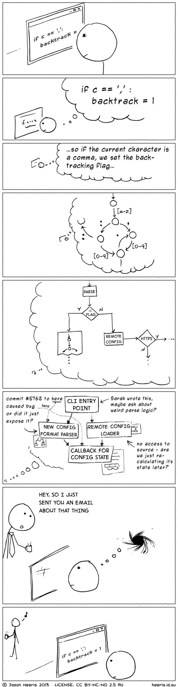
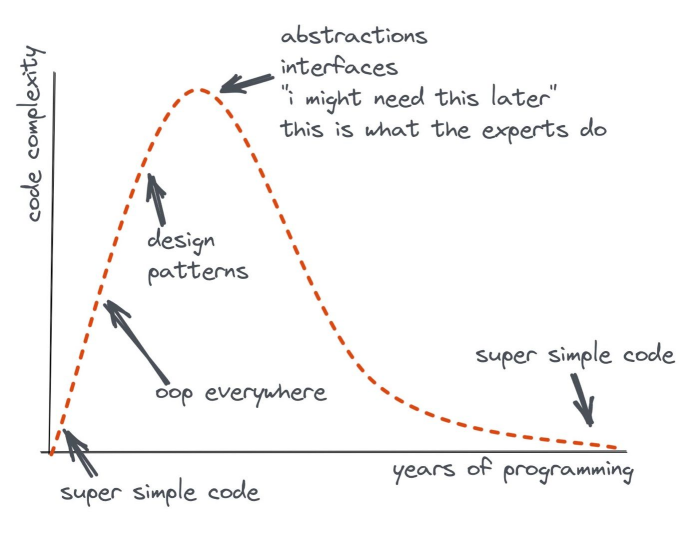

# La carga cognitiva es lo que importa

[Agents](https://github.com/zakirullin/cognitive-load/blob/main/README.agents.md) | [Blog version](https://minds.md/zakirullin/cognitive) | [Chinese](https://github.com/zakirullin/cognitive-load/blob/main/README.zh-cn.md) | [Korean](README.ko.md) | [Turkish](README.tr.md) | [Japanese](README.ja.md) | [Spanish](README.es.md)

*Este es un documento "vivo", última actualización: octubre de 2025. ¡Tus contribuciones son bienvenidas!*

## Introducción
Existen muchas palabras de moda y “mejores prácticas” por ahí, pero la mayoría han fracasado. Fracasaron porque fueron imaginadas, no reales. Estas ideas se basaban en la estética y en juicios subjetivos. Necesitamos algo más fundamental, algo que no pueda estar equivocado.

A veces sentimos confusión al leer el código. La confusión cuesta tiempo y dinero. La confusión es causada por una alta *carga cognitiva*. No es un concepto elegante y abstracto, sino **una limitación humana fundamental**. No es imaginaria, está ahí y podemos sentirla.  

Como pasamos mucho más tiempo leyendo y entendiendo código que escribiéndolo, deberíamos preguntarnos constantemente si estamos incorporando una carga cognitiva excesiva en nuestro código.

## Carga cognitiva
> La carga cognitiva es cuánto necesita pensar un desarrollador para completar una tarea.

Al leer código, incorporas en tu mente cosas como los valores de las variables, la lógica del flujo de control y las secuencias de llamadas. La persona promedio puede mantener aproximadamente [cuatro de estos fragmentos](https://github.com/zakirullin/cognitive-load/issues/16) en la memoria de trabajo. Una vez que la carga cognitiva alcanza este umbral, se vuelve mucho más difícil entender las cosas.

*Supongamos que se nos ha pedido hacer algunas correcciones en un proyecto completamente desconocido. Nos dijeron que un desarrollador muy inteligente había contribuido en él. Se usaron muchas arquitecturas geniales, bibliotecas elegantes y tecnologías de moda. En otras palabras, **el autor había creado una alta carga cognitiva para nosotros.***

<div align="center">
  
</div>

Deberíamos reducir la carga cognitiva en nuestro proyectos tanto como sea posible.

<details>
  <summary><b>Carga cognitiva e interrupciones</b></summary>
  <div align="center">
    
  </div>
</details>

> Vamos a utilizar "carga cognitiva" en un sentido informal; a veces se alineará con el concepto científico específico de Carga Cognitiva, pero no sabemos lo suficiente sobre dónde coincide y dónde no.

## Tipos de carga cognitiva
**Intrínseca**: causada por la dificultad inherente de una tarea. No se puede reducir; es la esencia misma del desarrollo de software.

**Extraña**: generada por la forma en que se presenta la información. Causada ​​por factores que no son directamente relevantes para la tarea, como las peculiaridades del autor. Se pueden reducir considerablemente. Nos centraremos en este tipo de carga cognitiva.

<div align="center">
  
</div>

Pasemos directamente a los ejemplos prácticos concretos de carga cognitiva extraña.

---

Nos referiremos al nivel de carga cognitiva de la siguiente manera:
`🧠`: memoria de trabajo fresca, carga cognitiva cero
`🧠++`: dos datos en nuestra memoria de trabajo, carga cognitiva aumentada
`🤯`: sobrecarga cognitiva, más de 4 datos

> Nuestro cerebro es mucho más complejo e inexplorado, pero podemos seguir con este modelo simplista.

## Condicionales complejas
```go
if val > algunaConstante // 🧠+
    && (condicion2 || condicion3) // 🧠+++, la condición anterior debe ser verdadera, una de c2 o c3 debe ser verdadera
    && (condicion4 && !condicion5) { // 🤯, estamos jodidos en este punto
    ...
}
```

Introduzca variables intermedias con nombres significativos:
```go
esValido = val > algunaConstante
esPermitido = condicion2 || condicion3
esSeguro = condicion4 && !condicion5 
// 🧠, no necesitamos recordar las condiciones, hay variables descriptivas
if esValido && isPermitido && esSeguro {
    ...
}
```

## ifs anidados
```go
if esValido { // 🧠+, okay, el código anidado se aplica solo a entradas válidas
    if esSeguro { // 🧠++, hacemos cosas solo para información válida y segura
        cosas // 🧠+++
    }
} 
```

Compárelo con los resultados de antes:
```go
if !esValido
    return
 
if !esSeguro
    return

// 🧠, realmente no nos importan los retornos tempranos, si estamos aquí entonces todo bien

cosas // 🧠+
```

Podemos centrarnos únicamente en el camino feliz, liberando así nuestra memoria de trabajo de todo tipo de precondiciones.

## La pesadilla de la herencia
Se nos pide que cambiemos algunas cosas para nuestros usuarios administradores: `🧠`

`AdminController extends UserController extends GuestController extends BaseController`

Ohh, parte de la funcionalidad está en `BaseController`, echemos un vistazo: `🧠+`
Se introdujeron las mecánicas de roles básicos en `GuestController`: `🧠++`
Las cosas se modificaron parcialmente en `UserController`: `🧠+++`
Por fin estamos aquí, `AdminController`, ¡vamos a programar cosas! `🧠++++`

Ah, espera, existe `SuperuserController`, que extiende `AdminController`. Al modificar `AdminController`, podemos romper cosas en la clase heredada, así que analicemos primero `SuperuserController`: `🤯`

Prefiere la composición a la herencia. No entraremos en detalles - hay [mucho material](https://www.youtube.com/watch?v=hxGOiiR9ZKg) disponible al respecto.

## Demasiados métodos, clases o módulos pequeños
> Método, clase y módulo son intercambiables en este contexto.

Mantras como "los métodos deben ser más cortos que 15 líneas de código" o "las clases deben ser pequeñas" resultaron ser algo erróneos.

**Módulo profundo**: interfaz simple, funcionalidad compleja.
**Módulo superficial**: interfaz relativamente compleja en comparación con la pequeña funcionalidad que ofrece. 

<div align="center">
  
</div>

Tener demasiados módulos superficiales puede dificultar la comprensión del proyecto. **No solo debemos tener en cuenta las responsabilidades de cada módulo, sino también todas sus interacciones.** Para comprender el propósito de un módulo superficial, primero debemos analizar la funcionalidad de todos los módulos relacionados. Saltar entre componentes tan superficiales es mentalmente agotador; el <a target="_blank" href="https://blog.separateconcerns.com/2023-09-11-linear-code.html">pensamiento lineal</a> es más natural para nosotros los humanos. 

> Ocultar información es de suma importancia y no ocultamos tanta complejidad en módulos superficiales.

Tengo dos proyectos personales, ambos con unas 5000 líneas de código. El primero tiene 80 clases superficiales, mientras que el segundo solo 7 clases profundas. No he mantenido ninguno de estos proyectos durante un año y medio.

Al regresar, me di cuenta de lo extremadamente difícil que era desentrañar todas las interacciones entre esas 80 clases del primer proyecto. Tendría que reconstruir una enorme carga cognitiva antes de poder empezar a programar. Por otro lado, pude comprender el segundo proyecto rápidamente, ya que solo tenía unas pocas clases profundas con una interfaz sencilla.
 

> Los mejores componentes son aquellos que proporcionan una funcionalidad potente pero tienen una interfaz sencilla.  
> 
> *John Ousterhout, Una filosofía del diseño de software*

La interfaz de I/O de Unix es muy sencilla. Solo tiene cinco llamadas básicas:
```python
open(path, flags, permissions)
read(fd, buffer, count)
write(fd, buffer, count)
lseek(fd, offset, referencePosition)
close(fd)
```

Una implementación moderna de esta interfaz tiene **cientos de miles de líneas de código**. Aunque esconde mucha complejidad, es fácil de usar gracias a su interfaz sencilla.

> Este ejemplo de módulo profundo se extrae del libro [Una filosofía del diseño de software](https://web.stanford.edu/~ouster/cgi-bin/book.php) de John Ousterhout. Este libro no solo aborda la esencia misma de la complejidad en el desarrollo de software, sino que también ofrece la mejor interpretación del influyente artículo de Parnas [Sobre los criterios que se deben utilizar para descomponer sistemas en módulos](https://www.win.tue.nl/~wstomv/edu/2ip30/references/criteria_for_modularization.pdf). Ambos son lecturas esenciales. Otras lecturas relacionadas: [Una filosofía del diseño de software vs. código limpio](https://github.com/johnousterhout/aposd-vs-clean-code), [Probablemente sea hora de dejar de recomendar código limpio](https://qntm.org/clean), [Funciones pequeñas consideradas dañinas](https://copyconstruct.medium.com/small-functions-considered-harmful-91035d316c29).

<details>
    <summary><b>Las cosas importantes deben ser grandes, ejemplos</b></summary>
    <br>
    <div align="center">
        
    </div>
    <blockquote>Si permites que tus funciones "cruciales" importantes sean más grandes ("sucias") es más fácil distinguirlas del mar de funciones, son obviamente importantes: ¡solo míralas, son grandes!</blockquote>
    Esta imagen está tomada del artículo <a href="https://htmx.org/essays/codin-dirty/" target="_blank">Codin' Dirty</a> de Carson Gross. Allí encontrarás <a href="https://htmx.org/essays/codin-dirty/#real-world-examples" target="_blank">ejemplos del mundo real</a> de funciones profundas.
</details>

P.D. Si crees que apoyamos objetos divinos inflados y con demasiadas responsabilidades, te equivocas.

## Responsable de una cosa
Con demasiada frecuencia, terminamos creando muchos módulos superficiales, siguiendo el principio impreciso de que «un módulo debe ser responsable de una sola cosa». ¿Qué es esta cosa difusa? Instanciar un objeto es una cosa, ¿verdad? Entonces, [MetricsProviderFactoryFactory](https://minds.md/benji/frameworks) parece estar bien. **Los nombres e interfaces de dichas clases tienden a ser más exigentes mentalmente que sus implementaciones completas, ¿qué tipo de abstracción es esa?** Algo salió mal.  

Realizamos cambios en nuestros sistemas para satisfacer a nuestros usuarios y actores. Somos responsables ante ellos.

> Un módulo debe ser responsable ante un solo usuario o actor.

De esto se trata el Principio de Responsabilidad Única. En pocas palabras, si introducimos un error en un lugar y luego dos profesionales distintos vienen a quejarse, hemos violado el principio. No tiene nada que ver con la cantidad de tareas que realizamos en nuestro módulo.    

Pero incluso ahora, esta regla puede ser más perjudicial que beneficiosa. Este principio puede entenderse de tantas maneras diferentes como individuos. Un mejor enfoque sería analizar la carga cognitiva que genera. Es mentalmente exigente recordar que un cambio en un lugar puede desencadenar una cadena de reacciones en diferentes áreas del negocio. Y eso es todo, sin términos complejos que aprender.  

## Demasiados microservicios superficiales
Este principio de módulo superficial-profundo es independiente de la escala y puede aplicarse a la arquitectura de microservicios. Demasiados microservicios superficiales no servirán de nada: la industria se encamina hacia "macroservicios", es decir, servicios que no son tan superficiales (=profundos). Uno de los fenómenos más graves y difíciles de solucionar es el llamado monolito distribuido, que a menudo resulta de esta separación superficial excesivamente granular.

En una ocasión, asesoré a una startup donde un equipo de cinco desarrolladores introdujo 17(!) microservicios. Llevaban 10 meses de retraso y estaban lejos de su lanzamiento público. Cada nuevo requisito implicaba cambios en 4+ microservicios. Reproducir y depurar un problema en un sistema tan distribuido requería muchísimo tiempo. Tanto el tiempo de comercialización como la carga cognitiva eran inaceptablemente altos. `🤯`

¿Es esta la manera correcta de abordar la incertidumbre de un nuevo sistema? Es extremadamente difícil establecer los límites lógicos correctos al principio. La clave está en tomar decisiones lo más tarde posible, ya que es cuando se dispone de más información. Al introducir una capa de red desde el comienzo, dificultamos la reversión de nuestras decisiones de diseño desde el principio. La única justificación del equipo fue: «Las empresas FAANG demostraron la eficacia de la arquitectura de microservicios». *Hola, tienen que dejar de soñar a lo grande.*

El [debate Tanenbaum-Torvalds](https://en.wikipedia.org/wiki/Tanenbaum%E2%80%93Torvalds_debate)  argumentó que el diseño monolítico de Linux era defectuoso y obsoleto, y que debería utilizarse una arquitectura de micronúcleo. De hecho, el diseño de micronúcleo parecía ser superior tanto desde un punto de vista teórico como estético. En la práctica, tres décadas después, GNU Hurd, basado en micronúcleo, sigue en desarrollo, y Linux monolítico está en todas partes. Esta página funciona con Linux, tu tetera inteligente funciona con Linux. Con Linux monolítico.

Un monolito bien diseñado con módulos verdaderamente aislados suele ser mucho más flexible que un conjunto de microservicios. Además, requiere mucho menos esfuerzo cognitivo para su mantenimiento. Solo cuando la necesidad de implementaciones independientes se vuelve crucial, como al escalar el equipo de desarrollo, se debe considerar añadir una capa de red entre los módulos, los futuros microservicios.

## Lenguajes ricos en funciones
Nos emocionamos cuando se lanzan nuevas funciones en nuestro lenguaje favorito. Dedicamos tiempo a aprenderlas y desarrollamos código a partir de ellas.

Si hay muchas funciones, podemos pasar media hora probando algunas líneas de código para usar una u otra. Y es una pérdida de tiempo. Y lo que es peor, **cuando vuelvas más tarde, ¡tendrás que replantearte ese proceso!**
 
**No sólo tienes que entender este complicado programa, tienes que entender por qué un programador decidió que esta era la forma de abordar un problema a partir de las características disponibles.** `🤯`

Estas declaraciones las hace nada menos que Rob Pike.

> Reduce la carga cognitiva limitando el número de opciones. 

Las características del lenguaje están bien, siempre que sean ortogonales entre sí.

<details>
  <summary><b>Reflexiones de un ingeniero con 20 años de experiencia en C++ ⭐️</b></summary>
  <br>
  El otro día estaba mirando mi lector RSS y me di cuenta de que tengo unos trescientos artículos sin leer bajo la etiqueta "C++". No he leído ni un solo artículo sobre el lenguaje desde el verano pasado, ¡y me siento genial!<br><br>
  Llevo 20 años usando C++, casi dos tercios de mi vida. Gran parte de mi experiencia reside en lidiar con los aspectos más oscuros del lenguaje (como comportamientos indefinidos de todo tipo). No es una experiencia reutilizable, y resulta un poco inquietante tirarlo todo ahora.<br><br>
  Como podrás imaginar, el token <code>||</code> tiene un significado diferente en <code>requires ((!P&lt;T&gt; || !Q&lt;T&gt;))</code> y en <code>requires (!(P&lt;T&gt; || Q&lt;T&gt;))</code>. El primero es la disyunción de restricción, el segundo es el viejo operador lógico OR, y se comportan de manera diferente.<br><br>
  No se puede asignar espacio para un tipo trivial y simplemente <code>memcpy</code> un conjunto de bytes sin esfuerzo adicional; eso no iniciará el ciclo de vida de un objeto. Esto ocurría antes de C++20. Se corrigió en C++20, pero la carga cognitiva del lenguaje solo ha aumentado.<br><br>
  La carga cognitiva crece constantemente, incluso después de que se hayan corregido algunas cosas. Debería saber qué se corrigió, cuándo se corrigió y cómo era antes. Después de todo, soy un profesional. Claro, C++ es bueno en la compatibilidad con versiones anteriores, lo que también significa que <b>te enfrentarás</b> a ellas. Por ejemplo, el mes pasado un colega me preguntó sobre cierto comportamiento en C++03.<code>🤯</code><br><br>
  Había 20 métodos de inicialización. Se había añadido una sintaxis de inicialización uniforme. Ahora tenemos 21 métodos de inicialización. Por cierto, ¿alguien recuerda las reglas para seleccionar constructores de la lista de inicializadores? Algo sobre la conversión implícita con la mínima pérdida de información, <i>pero si</i> el valor se conoce estáticamente, entonces...<code>🤯</code><br><br>
  <b>Este aumento de la carga cognitiva no se debe a una tarea empresarial en cuestión. No es una complejidad intrínseca del dominio. Simplemente existe debido a razones históricas</b> (<i>carga cognitiva extraña</i>).<br><br>
  Tuve que idear algunas reglas. Por ejemplo, si esa línea de código no es tan obvia y tengo que recordar el estándar, mejor no escribirla así. El estándar tiene unas 1500 páginas, por cierto.<br><br>
  <b>De ninguna manera estoy tratando de culpar a C++.</b> Me encanta el lenguaje. Es solo que ahora estoy cansado.<br><br>
  <p>Gracias a <a href="https://0xd34df00d.me" target="_blank">0xd34df00d</a> por el escrito.</p>
</details>


## Lógica de negocio y códigos de estado HTTP
En el backend, devolvemos: 
`401` para token JWT vencido
`403` para acceso insuficiente
`418` para usuarios bloqueados 

Los ingenieros del frontend usan la API del backend para implementar la funcionalidad de inicio de sesión. Tienen que crear temporalmente la siguiente carga cognitiva en sus cerebros:
`401` es para token JWT vencido // `🧠+`, ok solo recuérdalo temporalmente 
`403` es para acceso insuficeinte // `🧠++`  
`418` es para usuarios bloqueados // `🧠+++`  

Los desarrolladores frontend introducirían (con suerte) algún tipo de diccionario «estado numérico -> significado» de su lado, de modo que las generaciones posteriores de colaboradores no tuvieran que recrear este mapeo en sus cerebros.

Entonces entran en juego los ingenieros de control de calidad:
"Oye, tengo el estado `403`, ¿ese token está vencido o no hay suficiente acceso?"
**Los ingenieros de control de calidad no pueden comenzar directamente con las pruebas, porque primero tienen que recrear la carga cognitiva que alguna vez crearon los ingenieros del backend.**

¿Por qué mantener esta asignación personalizada en nuestra memoria de trabajo? Es mejor abstraer los detalles de su negocio del protocolo de transferencia HTTP y devolver códigos autodescriptivos directamente en el cuerpo de la respuesta:
```json
{
    "code": "jwt_ha_expirado"
}
```

Carga cognitiva en el frontend: `🧠` (genial, no se tienen en cuenta los hechos)
Carga cognitiva en el control de calidad: `🧠`

La misma regla se aplica a todo tipo de estados numéricos (en la base de datos o donde sea): **usa cadenas autodescriptivas.** No estamos en la era de las computadoras de 640K para optimizar la memoria.

> La gente pasa tiempo discutiendo entre el `401` y el `403`, tomando decisiones basadas en sus propios modelos mentales. Se incorporan nuevos desarrolladores y necesitan recrear ese proceso de pensamiento. Puede que hayas documentado los "porqués" (ADR) de tu código, ayudando a los recién llegados a comprender las decisiones tomadas. Pero al final, simplemente no tiene sentido. Podemos separar los errores en relacionados con el usuario o con el servidor, pero aparte de eso, la información es bastante confusa.

P.D.: A menudo resulta difícil distinguir entre "autenticación" y "autorización". Podemos usar términos más simples como ["inicio de sesión" y "permisos"](https://ntietz.com/blog/lets-say-instead-of-auth/) para reducir la carga cognitiva.

## Abusar del principio DRY

No repetirse es uno de los primeros principios que se enseñan como ingenieros de software. Está tan arraigado en nosotros que no soportamos unas pocas líneas de código adicionales. Aunque en general es una regla buena y fundamental, su uso excesivo genera una carga cognitiva que no podemos manejar.

Hoy en día, todos desarrollamos software basado en componentes lógicamente separados. A menudo, estos se distribuyen entre múltiples bases de código que representan servicios separados. Al esforzarnos por eliminar cualquier repetición, podemos terminar creando un acoplamiento estrecho entre componentes no relacionados. Como resultado, los cambios en una parte pueden tener consecuencias imprevistas en otras áreas aparentemente no relacionadas. También pueden dificultar la capacidad de reemplazar o modificar componentes individuales sin afectar a todo el sistema.`🤯`  

De hecho, el mismo problema surge incluso dentro de un mismo módulo. Podrías extraer alguna funcionalidad común demasiado pronto, basándote en similitudes percibidas que podrían no existir a largo plazo. Esto puede generar abstracciones innecesarias difíciles de modificar o ampliar.

Rob Pike una vez dijo:

> Un poco de copia es mejor que un poco de dependencia.

Nos sentimos tentados a no reinventar la rueda con tanta fuerza que estamos dispuestos a importar bibliotecas grandes y pesadas para usar una función pequeña que podríamos escribir fácilmente nosotros mismos.

**Todas tus dependencias son tu código.** Recorrer más de 10 niveles de seguimiento de pila de alguna biblioteca importada y descubrir qué salió mal (*porque las cosas salen mal*) es doloroso.

## Acoplamiento estrecho con un marco
Hay mucha "magia" en los frameworks. Al depender demasiado de un framework, **obligamos a todos los futuros desarrolladores a aprender esa "magia" primero.** Puede llevar meses. Aunque los frameworks nos permiten lanzar MVP en cuestión de días, a la larga tienden a añadir complejidad y carga cognitiva innecesarias.

Peor aún, en algún momento, los frameworks pueden convertirse en una limitación importante al enfrentarse a un nuevo requisito que simplemente no se ajusta a la arquitectura. A partir de ahí, la gente termina bifurcando un framework y manteniendo su propia versión personalizada. Imagina la cantidad de carga cognitiva que un recién llegado tendría que desarrollar (es decir, aprender este framework personalizado) para aportar algún valor.`🤯`

**¡De ninguna manera abogamos por inventar todo desde cero!**

Podemos escribir código de forma relativamente independiente del framework. La lógica de negocio no debería residir en un framework, sino utilizar sus componentes. Sitúa el framework fuera de tu lógica principal. Úsalo como una biblioteca. Esto permitirá a los nuevos colaboradores aportar valor desde el primer día, sin necesidad de analizar primero la complejidad del framework. 

> [Porqué odio los Frameworks](https://minds.md/benji/frameworks)

## Arquitectura en capas
Hay un cierto entusiasmo ingenieril en torno a todo esto.

Yo mismo fui un ferviente defensor de la arquitectura hexagonal/cebolla durante años. La usé ocasionalmente y animé a otros equipos a hacer lo mismo. La complejidad de nuestros proyectos aumentó; incluso el número de archivos se duplicó. Parecía que estábamos escribiendo mucho código de unión. Ante los requisitos en constante cambio, teníamos que realizar cambios en múltiples capas de abstracciones; todo se volvió tedioso. `🤯`

**Se supone que la abstracción oculta la complejidad, aquí solo agrega [indirección](https://fhur.me/posts/2024/thats-not-an-abstraction).** Pasar de una llamada a otra para analizar y determinar qué falla y qué falta es fundamental para resolver un problema rápidamente. Con el desacoplamiento de capas de esta arquitectura, se requiere un factor exponencial de trazas adicionales, a menudo inconexas, para llegar al punto donde se produce el fallo. Cada traza de este tipo ocupa espacio en nuestra limitada memoria de trabajo. `🤯`  

Esta arquitectura parecía intuitiva al principio, pero cada vez que intentábamos aplicarla a nuestros proyectos, nos perjudicaba. Dedicamos años a actividades mentales innecesarias y a escribir código adhesivo inútil sin un valor comercial claro. Al contrario, empeoramos las cosas para el negocio al obligar a los recién llegados a aprender primero nuestros enfoques (modelos mentales). El tiempo de comercialización se ha reducido. Al final, lo abandonamos todo en favor del clásico principio de inversión de dependencias. **Sin términos de puerto/adaptador que aprender, sin capas innecesarias de abstracciones horizontales, sin carga cognitiva ajena.**

<details>
    <summary><b>Principios y experiencia de programación</b></summary>
    <div align="center">
        
    </div>
    <a href="https://twitter.com/flaviocopes">@flaviocopes</a>
</details>

Si crees que esta estratificación te permitirá reemplazar rápidamente una base de datos u otras dependencias, te equivocas. Cambiar el almacenamiento causa muchos problemas, y créenos, tener algunas abstracciones para la capa de acceso a datos es la menor de tus preocupaciones. En el mejor de los casos, las abstracciones pueden ahorrar aproximadamente un 10 % del tiempo de migración (si es que lo hay); el verdadero problema reside en las incompatibilidades del modelo de datos, los protocolos de comunicación, los desafíos de los sistemas distribuidos y las [interfaces implícitas](https://www.hyrumslaw.com).  

> Con un número suficiente de usuarios de una API, 
> no importa lo que prometas en el contrato:
> alguien dependerá de todos 
> los comportamientos observables de tu sistema.

Realizamos una migración de almacenamiento que nos llevó unos 10 meses. El sistema anterior era de un solo subproceso, por lo que los eventos expuestos eran secuenciales. Todos nuestros sistemas dependían de ese comportamiento observado. Este comportamiento no formaba parte del contrato de la API ni se reflejaba en el código. Un nuevo almacenamiento distribuido no ofrecía esa garantía: los eventos se producían desordenados. Gracias a una abstracción, dedicamos solo unas horas a programar un nuevo adaptador de almacenamiento. **Dedicamos los siguientes 10 meses a gestionar eventos desordenados y otros desafíos.** Resulta curioso decir que las abstracciones nos ayudan a reemplazar componentes rápidamente.

**Entonces, ¿por qué pagar el precio de una alta carga cognitiva por una arquitectura de capas así, si no da resultados en el futuro?** Además, en la mayoría de los casos, ese futuro de reemplazar algún componente central nunca sucede.

Estas arquitecturas no son fundamentales, sino consecuencias subjetivas y sesgadas de principios más fundamentales. ¿Por qué confiar en esas interpretaciones subjetivas? Sigamos las reglas fundamentales: principio de inversión de dependencias, fuente única de verdad, carga cognitiva y ocultación de información. Su lógica de negocio no debería depender de módulos de bajo nivel como bases de datos, interfaz de usuario o frameworks. Deberíamos poder escribir pruebas para nuestra lógica central sin preocuparnos por la infraestructura, y listo. [Discusión](https://github.com/zakirullin/cognitive-load/discussions/24).

No añadas capas de abstracciones solo por el bien de la arquitectura. Añádelas siempre que necesites una extensión justificada por razones prácticas.

**[Las capas de abstracción no son gratuitas](https://blog.jooq.org/why-you-should-not-implement-layered-architecture), deben almacenarse en nuestra memoria de trabajo limitada.**

<div align="center">
  
</div>

## Diseño orientado al dominio
El diseño orientado al dominio tiene aspectos muy positivos, aunque a menudo se malinterpreta. Se suele decir: «Escribimos código en DDD», lo cual resulta un tanto extraño, ya que DDD se centra más en el espacio del problema que en el espacio de la solución.

El lenguaje ubicuo, el dominio, el contexto delimitado, la agregación y la tormenta de eventos se centran en el espacio del problema. Su objetivo es ayudarnos a comprender el dominio y a delimitar sus fronteras. El DDD permite que desarrolladores, expertos en el dominio y profesionales de negocio se comuniquen eficazmente mediante un lenguaje único y unificado. En lugar de centrarnos en estos aspectos del espacio del problema del DDD, solemos enfatizar estructuras de carpetas, servicios, repositorios y otras técnicas del espacio de soluciones.

Es probable que nuestra interpretación de DDD sea única y subjetiva. Y si basamos el código en esta comprensión, es decir, si generamos una carga cognitiva innecesaria, los futuros desarrolladores estarán condenados al fracaso. `🤯`  

Las Topologías de Equipo ofrecen un marco mucho mejor y más fácil de entender que nos ayuda a distribuir la carga cognitiva entre los equipos. Los ingenieros tienden a desarrollar modelos mentales bastante similares tras aprender sobre las Topologías de Equipo. DDD, en cambio, parece crear diez modelos mentales distintos para diez lectores diferentes. En lugar de ser un terreno común, se convierte en un campo de batalla para debates innecesarios.

## Carga cognitiva en proyectos familiares

> El problema es que **familiaridad no es lo mismo que simplicidad.** Se *sienten* igual —esa misma facilidad para moverse por un espacio sin mucho esfuerzo mental— pero por razones muy distintas. Cada "truco ingenioso" (léase: "autocomplaciente") y poco convencional que uses supone un coste de aprendizaje para los demás. Una vez que lo hayan superado, les resultará más fácil trabajar con el código. Por eso es difícil reconocer cómo simplificar un código con el que ya estás familiarizado. ¡Por eso intento que "el recién llegado" critique el código antes de que se acostumbre demasiado a la rutina!
>
> Es probable que el autor o autores anteriores crearan este enorme desastre poco a poco, no de golpe. Así que eres la primera persona que ha tenido que intentar darle sentido a todo de una vez.
>
> En mi clase, un día describí un procedimiento de almacenado SQL muy extenso que estábamos analizando, con cientos de líneas de condicionales en una cláusula WHERE enorme. Alguien preguntó cómo era posible que llegara a ese extremo. Les respondí: "Cuando solo hay dos o tres condicionales, añadir uno más no supone ninguna diferencia. ¡Pero cuando hay veinte o treinta, añadir uno más tampoco supone ninguna diferencia!".
>
> No existe ninguna "fuerza simplificadora" que actúe sobre el código fuente, aparte de las decisiones deliberadas que tomes. Simplificar requiere esfuerzo, y la gente suele tener demasiada prisa.  
>
> *Gracias a [Dan North](https://dannorth.net) por su comentario*.  

Si has interiorizado los modelos mentales del proyecto en tu memoria a largo plazo, no experimentarás una alta carga cognitiva. 

<div align="center">
  
</div>

Cuantos más modelos mentales tenga que aprender un nuevo desarrollador, más tiempo tardará en aportar valor.

Una vez que incorpores a nuevos miembros a tu proyecto, intenta medir su nivel de confusión (la programación en parejas puede ser útil). Si permanecen confundidos durante más de 40 minutos seguidos, es probable que tengas aspectos que mejorar en tu código.

Si mantienes la carga cognitiva baja, los nuevos miembros del equipo podrán contribuir a tu código base en las primeras horas tras incorporarse a la empresa.

## Ejemplos
- Nuestra arquitectura es una arquitectura estándar de aplicación CRUD, [un monolito de Python sobre Postgres](https://danluu.com/simple-architectures/)
- Cómo Instagram escaló a 14 millones de usuarios con [solo 3 ingenieros](https://read.engineerscodex.com/p/how-instagram-scaled-to-14-million)
- Las compañías donde nos quedábamos como ”wow, estos tipos son [súper inteligentes](https://kenkantzer.com/learnings-from-5-years-of-tech-startup-code-audits/)” en su mayoría fracasaron
- Una función que conecta todo el sistema. Si quieres saber cómo funciona el sistema - [léelo](https://www.infoq.com/presentations/8-lines-code-refactoring)
- Diseño para la comprensibilidad: [El algoritmo de consenso Raft](https://www.youtube.com/watch?v=vYp4LYbnnW8)

Estas arquitecturas son un tanto aburridas y fáciles de entender. Cualquiera puede comprenderlas sin mucho esfuerzo mental.

Involucra a los desarrolladores junior en las revisiones de arquitectura; te ayudarán a identificar las áreas que requieren mayor esfuerzo mental.

> Los sistemas de software son quizás las cosas más intrincadas y complejas (en términos de número de tipos distintos de partes) que crea la humanidad. 
> 
> *Fred Brooks, El mítico hombre-mes*

**El mantenimiento del software es difícil**, las cosas fallan y necesitaríamos aprovechar al máximo el esfuerzo mental disponible. Cuantos menos componentes tenga el sistema, menos problemas habrá. La depuración también será menos exigente mentalmente.

> Depurar el código es el doble de difícil que escribirlo. Por lo tanto, si escribes el código de la forma más ingeniosa posible, por definición, no eres lo suficientemente inteligente como para depurarlo.
>
> *Brian Kernighan*

En general, la mentalidad de «¡Guau, esta arquitectura sí que sienta bien!» es engañosa. Se trata de una "sensación subjetiva puntual" que no dice nada sobre la realidad. Un enfoque mucho mejor es observar las consecuencias a largo plazo:
- ¿Es fácil reproducir y depurar un problema? ¿O hay que navegar entre las pilas de llamadas o los componentes distribuidos, intentando comprenderlo todo mentalmente?
- ¿Podemos realizar cambios rápidamente, o hay muchas incógnitas y la gente tiene miedo de tocar cosas?
- ¿Pueden los nuevos usuarios añadir funcionalidades rápidamente? ¿Hay modelos mentales específicos que aprender?

> ¿Qué son esos modelos mentales únicos? Se trata de un conjunto de reglas, generalmente una mezcla de DDD/CQRS/Arquitectura Limpia/Arquitectura Orientada a Eventos. Esta es una interpretación personal del autor sobre aquello que más le entusiasma. Sus propios modelos mentales subjetivos. **Carga cognitiva adicional que otros deben internalizar.**

Estas preguntas son mucho más difíciles de rastrear, y a menudo la gente prefiere no responderlas directamente. Fíjate en algunos de los sistemas de software más complejos del mundo, los que han resistido el paso del tiempo: Unix, Kubernetes, Chrome y Redis (ver comentarios más abajo). No encontrarás nada sofisticado en ellos; en general, son bastante simples, y eso es bueno.

## Conclusión
Imaginemos por un momento que lo que inferimos en el segundo capítulo no es cierto. Si ese es el caso, entonces la conclusión que acabamos de refutar, junto con las conclusiones del capítulo anterior que habíamos aceptado como válidas, podrían no ser correctas tampoco. `🤯`  

¿Lo notas? No solo tienes que leer todo el artículo para entenderlo (¡módulos superficiales!), sino que el párrafo en general es difícil de comprender. Te hemos generado una carga cognitiva innecesaria. **No les hagas esto a tus compañeros.**

<div align="center">
  
</div>

Debemos reducir cualquier carga cognitiva que exceda lo que es intrínseco al trabajo que realizamos.

---
[LinkedIn](https://www.linkedin.com/in/zakirullin/), [X](https://twitter.com/zakirullin), [GitHub](https://github.com/zakirullin), artemzr(аt)g-yоu-knоw-com

## Comentarios

**Rob Pike** *(Unix, Golang)*  
Nice article.

**[Andrej Karpathy](https://x.com/karpathy/status/1872038630405054853)** *(ChatGPT, Tesla)*  
Nice post on software engineering. Probably the most true, least practiced viewpoint.

**[Elon Musk](https://x.com/elonmusk/status/1872346903792566655)** *(Rockets)*  
True.

**[Addy Osmani](https://www.linkedin.com/feed/update/urn:li:activity:7277757844970520576/)** *(Chrome, the most complex software system in the world)*  
I've seen countless projects where smart developers created impressive architectures using the latest design patterns and microservices. But when new team members tried to make changes, they spent weeks just trying to understand how everything fits together. The cognitive load was so high that productivity plummeted and bugs multiplied.

The irony? Many of these complexity-inducing patterns were implemented in the name of "clean code."

What really matters is reducing unnecessary cognitive burden. Sometimes this means fewer, deeper modules instead of many shallow ones. Sometimes it means keeping related logic together instead of splitting it into tiny functions.

And sometimes it means choosing boring, straightforward solutions over clever ones. The best code isn't the most elegant or sophisticated - it's the code that future developers (including yourself) can understand quickly.

Your article really resonates with the challenges we face in browser development. You're absolutely right about modern browsers being among the most complex software systems. Managing that complexity in Chromium is a constant challenge that aligns perfectly with many of the points you made about cognitive load.

One way we try to handle this in Chromium is through careful component isolation and well-defined interfaces between subsystems (like rendering, networking, JavaScript execution, etc.). Similar to your deep modules example with Unix I/O - we aim for powerful functionality behind relatively simple interfaces. For instance, our rendering pipeline handles incredible complexity (layout, compositing, GPU acceleration) but developers can interact with it through clear abstraction layers.

Your points about avoiding unnecessary abstractions really hit home too. In browser development, we constantly balance between making the codebase approachable for new contributors while handling the inherent complexity of web standards and compatibility.

Sometimes the simplest solution is the best one, even in a complex system.

**[antirez](https://x.com/antirez)** *(Redis)*  
Totally agree about it :) Also, what I believe is missing from mentioned "A Philosophy of Software Design" is the concept of "design sacrifice". That is, sometimes you sacrifice something and get back simplicity, or performances, or both. I apply this idea continuously, but often is not understood.

A good example is the fact that I always refused to have hash items expires. This is a design sacrifice because if you have certain attributes only in the top-level items (the keys themselves), the design is simpler, values will just be objects. When Redis got hash expires, it was a nice feature but required (indeed) many changes to many parts, raising the complexity.

Another example is what I'm doing right now, Vector Sets, the new Redis data type. I decided that Redis would not be the source of truth about vectors, but that it can just take an approximate version of them, so I was able to do on-insert normalization, quantization without trying to retain the large floats vector on disk, and so forth. Many vector DBs don't sacrifice the fact of remembering what the user put inside (the full precision vector).

These are just two random examples, but I apply this idea everywhere. Now the thing is: of course one must sacrifice the right things. Often, there are 5% features that account for a very large amount of complexity: that is a good thing to kill :D

**[A developer from the internet](https://working-for-the-future.medium.com/about)**  
You would not hire me... I sell myself on my track record of released enterprise projects.

I worked with a guy that could speak design patterns. I could never speak that way, though I was one of the few that could well understand him. The managers loved him and he could dominate any development conversation. The people working around him said he left a trail of destruction behind him. I was told that I was the first person that could understand his projects. Maintainability matters. I care most about TCO (*Total Cost of Ownership*). For some firms, that's what matters.

I logged into Github after not being there for a while and for some reason it took me to an article in a repository by someone that seemed random. I was thinking "what is this" and had some trouble getting to my home page, so I read it. I didn't really register it at the time, but it was amazing. Every developer should read it. It largely said that almost everything we've been told about programming best practices leads to excessive "cognitive load", meaning our minds are getting kicked by the intellectual demands. I've known this for a while, especially with the demands of cloud, security and DevOps.

I also liked it because it described practices I have done for decades, but never much admit to because they are not popular... I write really complicated stuff and need all the help I can get.

Consider, if I'm right, it popped up because the Github folks, very smart people, though that developers should see it. I agree.

[Comments on Hacker News](https://news.ycombinator.com/item?id=45074248) ([2](https://news.ycombinator.com/item?id=42489645))
