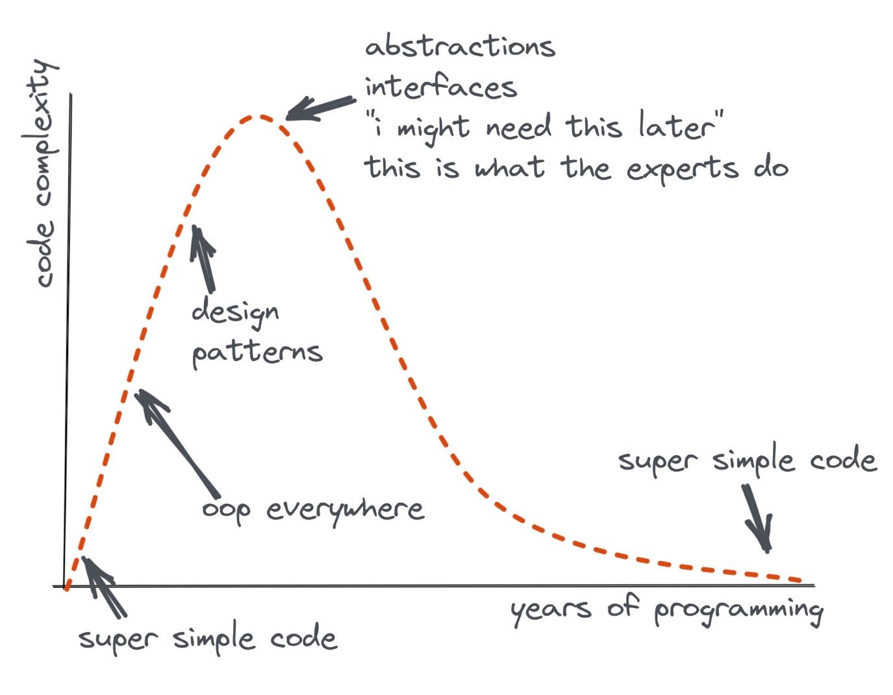

# Cognitive Load Developer's Handbook

## Introduction
We spend far more time reading and understanding code than writing it. Therefore, **the amount of cognitive load we need to build in our brains in order to understand code is a crucial metric**.

## Cognitive load
> **Cognitive load is how much a developer needs to know in order to complete a task.**

We should strive to reduce the cognitive load in our projects as much as possible.

The average person can hold roughly [four unrelated facts](https://github.com/zakirullin/cognitive-load/issues/16) in working memory. Once the cognitive load reaches this threshold, a significant effort is required to understand things.

*Let's say we have been asked to make some fixes to a completely unfamiliar project. We were told that a really smart developer had contributed to it. Lots of cool architectures, fancy libraries and trendy technologies were used. In other words, **the previous author once had a high cognitive load in his head, which we are yet to recreate.***


The tricky part is that the previous author didn't experience a high cognitive load because of the familiarity of the project. It is also possible that he added complexity incrementally, so that the cognitive load was low, and he could keep it all in his head.

<details>
  <summary>Simplicity vs Familiarity, Dan North's comments</summary>
  The problem is that <b>familiarity is not the same as simplicity</b>. They <i>feel</i> the same — that same ease of moving through a space without much mental effort — but for very different reasons. Every “clever” (read: “self-indulgent”) and non-idiomatic trick you use incurs a learning penalty for everyone else. Once they have done that learning, then they will find working with the code less difficult. So it is hard to recognise how to simplify code that you are already familiar with. This is why I try to get “the new kid” to critique the code before they get too institutionalised!<br><br>
  It is likely that the previous author(s) created this huge mess one tiny increment at a time, not all at once. So you are the first person who has ever had to try to make sense of it all at once.<br><br>
  In my class I describe a sprawling SQL stored procedure we were looking at one day, with hundreds of lines of conditionals in a huge WHERE clause. Someone asked how anyone could have let it get this bad. I told them: “When there are only 2 or 3 conditionals, adding another one doesn’t make any difference. By the time there are 20 or 30 conditionals, adding another one doesn’t make any difference!”<br><br>
  There is no “simplifying force” acting on the code base other than deliberate choices that you make.Simplifying takes effort, and people are too often in a hurry.<br><br>
  Thanks to <a href="https://dannorth.net">Dan North</a> for sharing his ideas.
</details>

## Types of cognitive load
**Intrinsic** - is the inherent level of difficulty associated with a specific problem we are solving. It can't be reduced, it's at the very heart of software development.  

**Extraneous** - is generated by the manner in which information is presented, is imposed by factors not directly relevant to the problem we are trying to solve. Can be greatly reduced. We will focus on this type of cognitive load.

Let's jump straight to the concrete practical examples of extraneous cognitive load.

*P.S. Contributions are welcome! Feel free to send PRs with your own examples.*

---

> **Note**
> We will refer to the level cognitive load as follows:  
> `🧠`: fresh working memory, zero cognitive load  
> `🧠++`: two facts in our working memory, cognitive load increased  
> `🤯`: working memory overflow, more than 4 facts  

## Inheritance nightmare
We are asked to change a few things for our admin users: `🧠`

`AdminController extends UserController extends GuestController extends BaseController`

Ohh, part of the functionality is in `BaseController`, let's have a look: `🧠+`  
Basic role mechanics got introduced in `GuestController`: `🧠++`  
Things got partially altered in `UserController`: `🧠+++`  
Finally we are here, `AdminController`, let's code stuff! `🧠++++`  

Oh, wait, there's `SuperuserController` which extends `AdminController`. By modifying `AdminController` we can break things in the inherited class, so let's dive in `SuperuserController` first: `🤯`

Prefer composition over inheritance. We won't go into detail - there's [plenty of material](https://www.youtube.com/watch?v=hxGOiiR9ZKg) out there.

## Too many small methods, classes or modules
> **Note**
> Method, class and module are interchangeable in this context 
 
Mantras like "methods should be shorter than 15 lines of code" or "classes should be small" turned out to be somewhat wrong.

**Deep module** - simple interface, complex functionality  
**Shallow module** - interface is relatively complex to the small functionality it provides 


Having too many shallow modules can make it difficult understand the project. **Not only do we have to keep in mind each module responsibilities, but also all their interactions**. To understand the purpose of a shallow module, we first need to look at the functionality of all the related modules. `🤯`

> Information hiding is paramount, and we don't hide as much complexity in shallow modules.

I have two pet projects, both of them are somewhat 5K lines of code. The first one has 80 shallow classes, whereas the second one has only 7 deep classes. I haven't been maintaining any of these projects for one year and a half.

Once I came back, I realised that it is enormously difficult to untangle all the interactions between those 80 classes in the first project. I would have to rebuild an enormous amount of cognitive load before I could start coding. On the other hand, I was able to grasp the second project quickly, because it had only a few deep classes with a simple interface.

> **The best components are those that provide powerful functionality yet have simple interface.**  
John K. Ousterhout

The interface of the UNIX I/O is very simple. It has only five basic calls:
```python
open(path, flags, permissions)
read(fd, buffer, count)
write(fd, buffer, count)
lseek(fd, offset, referencePosition)
close(fd)
```

A modern implementation of this interface has **hundreds of thousands of lines of code**. Lots of complexity is hidden under the hood. Yet it is easy to use due to its simple interface.

> **Note**
> This deep module example is taken from the book [A Philosophy of Software Design](https://web.stanford.edu/~ouster/cgi-bin/book.php) by John K. Ousterhout. Not only does this book cover the very essence of complexity in software development, but it also has the greatest interpretation of Parnas' influential paper [On the Criteria To Be Used in Decomposing Systems into Modules](https://www.win.tue.nl/~wstomv/edu/2ip30/references/criteria_for_modularization.pdf). Both are essential reads. Another related reading: [Small Functions considered Harmful](https://copyconstruct.medium.com/small-functions-considered-harmful-91035d316c29).

> **Warning**
> If you think we are rooting for bloated God objects with too many responsibilities, you got it wrong.  

## Too many shallow microservices
We can apply the aforementioned scale-agnostic principle to microservices architecture as well. Too many shallow microservices won't do any good - the industry is heading towards somewhat "macroservices", i.e., services that aren't that shallow. One of the worst and hardest to fix phenomena is so-called distributed monolith, which is often the result of this overly granular shallow separation.

I once consulted a startup where a team of three developers introduced 17(!) microservices. They were 10 months behind schedule and appeared nowhere close to the public release. Every new requirement led to changes in 4+ microservices. Both time to market and cognitive load were unacceptably high. `🤯`  

Is this the right way to approach the uncertainty of a new system? It's enormously difficult to elicit the right logical boundaries in the beginning, and by introducing too many microservices we make things worse. The team's only justification was: "The FAANG companies proved microservices architecture to be effective".

A well-crafted monolith with truly isolated modules is often much more convenient and flexible than a bunch of microservices. It's only when the need for separate deployments becomes crucial (e.g. development team scaling) that you should consider adding a network layer between the modules (future microservices).

## Featureful languages
We feel excited when new features got released in our favourite language. We spend some time learning these features, we build code upon them.

If there are lots of features, we may spend half an hour playing with a few lines of code, to use one or another feature. And it's kinda waste of time. But what's worse, **when you come back later, you would have to recreate that thought process!** `🤯`

**You not only have to understand this complicated program, you have to understand why a programmer decided this was the way to approach a problem from the features that are available.**  

These statements are made by none other than Rob Pike.

> **Reduce cognitive load by limiting the number of choices.**  

Language features are OK, as long as they are orthogonal to each other.

## Business logic and HTTP status codes
On the backend we return:  
`401` for expired jwt token  
`403` for not enough access  
`418` for banned users  

The guys on the frontend use backend API to implement login functionality. They would have to temporarily  create the following cognitive load in their brains:  
`401` is for expired jwt token // `🧠+`, ok just temporary remember it  
`403` is for not enough access // `🧠++`  
`418` is for banned users // `🧠+++`  

Frontend devs would (hopefully) introduce variables/functions like `isTokenExpired(status)`, so that subsequent generations of developers wouldn't have to recreate this kind of `status -> meaning` mapping in their brains.

Then QA people come into play:
"Hey, I got `403` status, is that expired token or not enough access?"
**QA people can't jump straight to testing, because first they have to recreate the cognitive load that the guys on the backend once created.**

Why hold this custom mapping in our working memory? It's better to abstract away your business details from the HTTP transfer protocol, and return self-descriptive codes directly in the response body:
```json
{
    "code": "jwt_has_expired"
}
```

Cognitive load on the frontend side: `🧠` (fresh, no facts are held in mind)  
Cognitive load on the QA side: `🧠`

The same rule applies to all sorts of numeric statuses (in database or wherever) - prefer self-describing strings. We are not in the era of 640K computers to optimise for storage.  

> **Note**
> People spend time arguing between `401` and `403`, making choices based on their level of understanding. But in the end it just doesn't make any sense. We can separate errors into either user-related or server-related, but apart from that, things are kind of blurry. As for following this mystical "RESTful API" and using all sorts of HTTP verbs and statuses, the standard simply doesn't exist. The only valid document on the matter is a paper published by Roy Fielding, dated back in 2000, and it says nothing about verbs and statuses. People get along with just a few basic HTTP statuses and POSTs only, and they are doing just fine.

## Complicated if statements
```go
if val > someConstant // 🧠+
    && (condition2 || condition3) // 🧠+++, prev cond should be true, one of c2 or c3 has be true
    && (condition4 && !condition5) { // 🤯, we are messed up here
    ...
}
```

Introduce temporary variables with meaningful names:
```go
isValid = var > someConstant
isAllowed = condition2 || condition3
isSecure = condition4 && !condition5 
// 🧠, we don't need to remember the conditions, there are descriptive variables
if isValid && isAllowed && isSecure {
    ...
}
```

## Nested ifs
```go
if isValid { // 🧠+, okay nested code applies to valid input only
    if isSecure { // 🧠++, we do stuff1 for valid and secure input only
        stuff1 // 🧠+++
    }
    stuff2 // 🧠++++, we do stuff2 for all sorts of valid input, we should keep in mind stuff1, because it may interfere with our stuff2
} 
```

Compare it with the early returns and failing fast:
```go
if !isValid
    return
 
// 🧠, we don't really care about earlier returns, if we are here then all good

stuff2 // 🧠+

if !isSecure
    return
   
// 🧠+

stuff1 // 🧠++
```

We can focus on the happy path only, thus freeing our working memory from all sorts of preconditions.

## Abusing DRY principle

Do not repeat yourself - that is one of the first principles you are taught as a software engineer. It is so deeply embedded in ourselves that we can not stand the fact of a few extra lines of code. Although in general a good and fundamental rule, when overused it leads to the cognitive load we can not handle.

Nowadays, everyone builds software based on logically separated components. Often those are distributed among multiple codebases representing separate services. When you strive to eliminate any repetition, you might end up creating tight coupling between unrelated components. As a result changes in one part may have unintended consequences in other seemingly unrelated areas. It can also hinder the ability to replace or modify individual components without impacting the entire system. `🤯`  

In fact, the same problem arises even within a single module. You might extract common functionality too early, based on perceived similarities that might not actually exist in the long run. This can result in unnecessary abstractions that are difficult to modify or extend.  

Rob Pike once said:

> **A little copying is better than a little dependency.**  

We are tempted to not reinvent the wheel so strong that we are ready to import large, heavy libraries to use a small function that we could easily write by ourselves. It introduces unnecessary dependencies and bloated code. Make informed decisions about when to import external libraries and when it is more appropriate to write concise, self-contained code snippets to accomplish smaller tasks.

Ultimately, by being mindful of the DRY principle, we can write more efficient and manageable code, while abusing it could lead to indirect coupling (or just unnecessary coupling), premature abstractions and large, generic solutions, maintenance complexity, high cognitive load.

## Tight coupling with a framework
Frameworks evolve at their own pace, which in most cases doesn't match the lifecycle of our project.

By relying too heavily on a framework, we force all upcoming developers to learn that framework first (or its particular version). Even though frameworks enable us to launch MVPs in a matter of days, in the long run they tend to add unnecessary complexity and cognitive load.

Worse yet, at some point frameworks can become a significant constraint when faced with a new requirement that just doesn't fit the architecture. From here onwards people end up forking a framework and maintaining their own custom version. Imagine the amount of cognitive load a newcomer would have to build (i.e. learn this custom framework) in order to deliver any value. `🤯`

**By no means do we advocate to invent everything from scratch!**

We can write code in a somewhat framework-agnostic way. The business logic should not reside within a framework; rather, it should use the framework's components. Put a framework outside of your core logic. Use the framework in a library-like fashion. This would allow new contributors to add value from day one, without the need of going through debris of framework-related complexity first.

## DDD
Domain-driven design has some great points, although it is often misinterpreted. People say "We write code in DDD", which is a bit strange, because DDD is about problem space, not about solution space.

Ubiquitous language, domain, bounded context, aggregate, event storming are all about problem space. They are meant to help us learn the insights about the domain and extract the boundaries. DDD enables developers, domain experts and business people to communicate effectively using a single, unified language. Rather than focusing on these problem space aspects of DDD, we tend to emphasise particular folder structures, services, repositories, and other solution space techniques. 

Chances are that the way we interpret DDD is likely to be unique and subjective. And if we build code upon this understanding, i.e., if we create a lot of extraneous cognitive load - future developers are doomed. `🤯`

## Hexagonal/Onion architecture
There is a certain engineering excitement about all this stuff.

I myself was a passionate advocate of Onion Architecture for years. I used it here and there and encouraged other teams to do so. The complexity of our projects went up, the sheer number of files alone had doubled. It felt like we were writing a lot of glue code. On ever changing requirements we had to make changes across multiple layers of abstractions, it all became tedious. `🤯`

Jumping from call to call to read along and figure out what goes wrong and what is missing is a vital requirement to quickly solve problem. With this architecture’s layer uncoupling it requires an exponential factor of extra, often disjointed, traces to get to the point where the failure occurs. `🤯`  

This architecture was something that made intuitive sense at first, but every time we tried applying it to projects it made a lot more harm than good. In the end, we gave it all up in favour of the good old dependency inversion principle. **No port/adapter terms to learn, no unnecessary layers of horizontal abstractions, no extraneous cognitive load.**

> Do not add layers of abstractions for the sake of an architecture. Add them whenever you need an extension point that is justified for practical reasons. **Layers of abstraction aren't free of charge, they are to be held in our working memory**.  

Even though these layered architectures have accelerated an important shift from traditional database-centric applications to a somewhat infrastructure-independent approach, where the core business logic is independent of anything external, the idea is by no means novel.  

These architectures are not fundamental, they are just subjective, biased consequences of more fundamental principles. Why rely on those subjective interpretations? Follow the fundamentals instead: isolation, DIP, IoC, single source of truth, cohesion, coupling, true invariant, complexity, cognitive load and information hiding.

## Learning from the Giants
Take a look at the overarching design principles of one of the biggest tech companies:  
`Clarity`: The code’s purpose and rationale is clear to the reader.  
`Simplicity`: The code accomplishes its goal in the simplest way possible.  
`Concision`: The code is easy to discern the relevant details, and the naming and structure guide the reader through these details.  
`Maintainability`: The code is easy for a future programmer to modify correctly.  
`Consistency`: The code is consistent with the broader codebase.  

Does the new fancy buzzword comply with these principles? Or all it does is creating extraneous cognitive load?

<details>
  <summary>Here's a fun picture</summary>
  
  Code Complexity vs. Experience from <a href="https://twitter.com/flaviocopes">@flaviocopes</a>
</details>

## Conclusion
**If you are holding a lot of extraneous stuff in your head, think about future developers, yourself included. They would have to recreate this high cognitive load.**

> **Warning**
> Be aware that, as an author, you may not experience a high cognitive load because you have developed a mental model of your extraneous stuff over time. Others, however, do not have this mental model and would have to create a high cognitive load in their heads. In other words, extraneous things that are familiar to you are translated into an unnecessary cognitive load for others.    

*The intricate and multifaceted nature of cognitive load within the realm of comprehension and problem-solving necessitates a diligent and strategic approach in order to navigate the complexities and optimize mental capacity allocation.* `🤯`  

Do you feel it? The above statement is difficult to understand. We have just created an unnecessary cognitive load in your head. **Do not do this to your colleagues.**  


We have enough complexity in the work that we do already, why add more on top of that? We should reduce any cognitive load above and beyond what is intrinsic to the work we do.

**Do not make the lives of future developers harder.**

---
Connect on [LinkedIn](https://www.linkedin.com/in/zakirullin/) or follow on [Github](https://github.com/zakirullin) for more articles  

*Contributions are welcome!* 🌱
