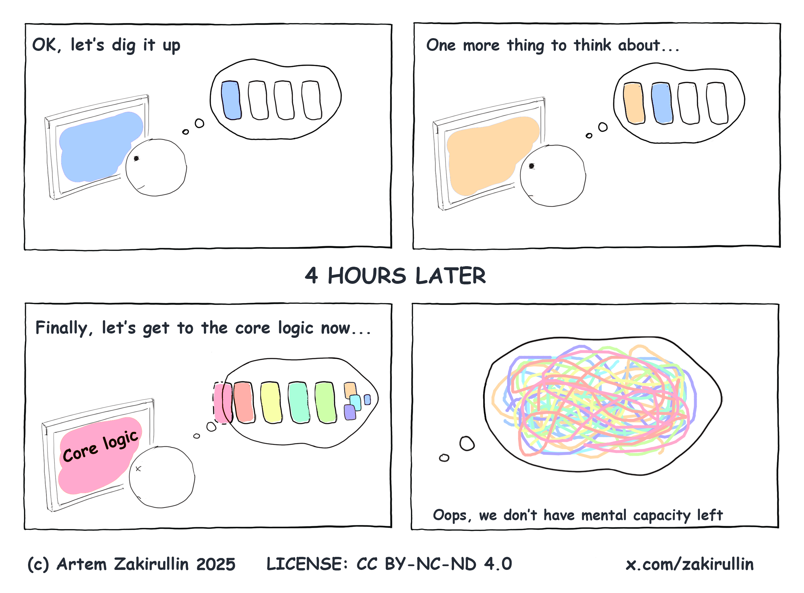

# Önemli olan bilişsel yüktür

## Giriş

Etrafta hatrı sayılır sayıda klişe söylemler ve "best practice" yapılar var, fakat bunların çoğu sadece sözde kalmış ve başarısızlıkla sonuçlanmıştır. Bizimse daha temel bir şeye ihtiyacımız var — yanlış olamayacak bir şeye.

Bazen bir kodu okurken kafa karışıklığı yaşarız. Bu karışıklık bize zaman ve para kaybettirir. Bunun nedeni, yüksek **bilişsel yüktür**.

Bu, öyle süslü püslü ve soyut bir kavram değil; aksine, **insan zihninin doğasından gelen temel bir sınırlamadır**. Hayal ürünü değil — gerçekten orada ve hepimiz onu hissediyoruz.

Çünkü kod yazmaya harcadığımız zamandan çok daha fazlasını onu **okumaya** ve **anlamaya** harcıyoruz. Bu yüzden kendimize sürekli şu soruyu sormalıyız:  
"**Yazdığımız koda gereğinden fazla bilişsel yük yüklüyor muyuz?**" 

## Bilişsel yük

> Bilişsel yük, bir geliştiricinin bir görevi tamamlamak için ne kadar düşünmesi gerektiğidir.

Kod okurken; değişken değerlerini, kontrol akışını ve fonksiyon çağrı dizilerini zihnimizde tutmamız gerekir. Fakat ilginçtir ki, ortalama bir insan, çalışma belleğinde bu türden yalnızca yaklaşık **[dört bilgi parçasını](https://github.com/zakirullin/cognitive-load/issues/16)** tutabilir. Bilişsel yük bu eşiğe ulaştığında, kodu anlamak **ciddi şekilde zorlaşır**.

*Diyelim ki bize tamamen yabancı bir projede bazı hataları düzeltmemiz söylendi. Projeye daha önce çok zeki bir geliştirici katkıda bulunmuş.  
Kulağa harika geliyor: karmaşık mimariler, havalı kütüphaneler ve trend teknolojiler kullanılmış.  
Yani başka bir deyişle, **yazarı bizim için oldukça yüksek bir bilişsel yük üretmiş**.*

<div align="center">
  
</div>

*Bu yüzden projelerimizde bilişsel yükü olabildğince azaltmalıyız.*

<details>
  <summary><b>Bilişsel yük ve bölünmeler</b></summary>
  <br>
</details>

## Bilişsel yükün türleri

**İçsel yük** - Görevin kendi doğasından gelen zorluk. Bu yük azaltılamaz; çünkü yazılım geliştirmenin tam kalbinde yer alır.

**Dışsal yük** - Bilginin sunuluş biçiminden kaynaklanır. Görevle doğrudan ilgisi olmayan ama kafa karıştıran unsurlar yüzünden oluşur — mesela “çok zeki” yazarın kendine has tuhaflıkları gibi. Bu tür yük ciddi şekilde azaltılabilir. Biz de zaten bu tip düşünsel yükü azaltmaya odaklanacağız. 

<div align="center">
  
</div>

Şimdi doğrudan dışsal bilişsel yükün somut pratik örneklerine geçelim.

---

Bilişsel yük düzeyini şu şekilde ifade edeceğiz:  
`🧠`: taze çalışma belleği, sıfır bilişsel yük  
`🧠++`: çalışma hafızamızdaki iki yük, bilişsel yükün arttığını gösteriyor  
`🤯`: Bilişsel aşırı yükleme, 4'ten fazla yük

> Beynimiz daha karmaşık ve keşfedilmemiş, fakat biz bu basite indirgenmiş modelle devam edebiliriz.

## Komplex koşullar

```go
if val > someConstant // 🧠+
    && (condition2 || condition3) // 🧠+++, önceki koşul doğru olmalı, c2 veya c3'ten biri doğru olmalı
    && (condition4 && !condition5) { // 🤯, bu noktada kafayı yedik
    ...
}
```

Anlamlı isimlere sahip ara değişkenleri tanıtın:

```go
isValid = val > someConstant
isAllowed = condition2 || condition3
isSecure = condition4 && !condition5 
// 🧠, koşulları hatırlamamıza gerek yok, tanımlayıcı değişkenler var
if isValid && isAllowed && isSecure {
    ...
}
```

## İç içe if döngüleri

```go
if isValid { // 🧠+, tamam, iç içe geçmiş kod yalnızca geçerli girdiye uygulanır
    if isSecure { // 🧠++, yalnızca geçerli ve güvenli girdi zaman devam ediyoruz
        stuff // 🧠+++
    }
} 
```

Bilişsel yükü bir de "early return" ile kıyaslayalım:

```go
if !isValid
    return

if !isSecure
    return

// 🧠, daha önceki getirileri pek umursamıyoruz, eğer buradaysak her şey yolunda demektir

stuff // 🧠+
```

Sadece “her şeyin yolunda gittiği senaryo”ya odaklanırsak, zihnimiz gereksiz ön koşullarla meşgul olmaz, daha rahat çalışırız.

## Inheritance kabusu

Yönetici kullanıcılarımız için birkaç şeyi değiştirmemiz isteniyor: `🧠`

`AdminController extends UserController extends GuestController extends BaseController`

Ohh, işin bir kısmı `BaseController`'da duruyor, bi' kontrol edelim: `🧠+`  
Temel rol mekanikleri `GuestController`'da eklenmiş: `🧠++`  
`UserController`'da bazı şeyler değiştirilmiş: `🧠+++`  
Ve sonunda, `AdminController`, artık kodlama zamanı! `🧠++++`  

Ama bir dakika, `AdminController` `SuperuserController`'dan extend edilmiş. `AdminController`’da bir değişiklik yaparsak, kalıtımla gelen bu sınıfta işler bozulabilir. Bu yüzden önce `SuperuserController`'a göz atmak lazım: `🤯`

Kalıtım (inheritance) yerine bileşimi (composition) tercih etmek en iyisi. Detaylara girmeyeceğiz ama internette bununla alakalı şöyle bir [video](https://www.youtube.com/watch?v=hxGOiiR9ZKg) var.

## Çok sayıda küçük metot, sınıf ya da modül

> Bu bağlamda metot, sınıf ve modül kelimeleri birbiriyle değiştirilebilir.

"Metotlar 15 satırı geçmemeli" ya da "sınıflar olabildiğince küçük olmalı" gibi yazılım dogmaları, zamanla pek de doğru olmadığını gösterdi.

**Deep module** - arayüzü basit, ama içinde karmaşık ve güçlü işler yapan yapı.  
**Shallow module** - arayüzü nispeten karmaşık ama yaptığı iş aslında çok basit olan yapı 

<div align="center">
  
</div>

Çok sayıda yüzeysel modül olması, projeyi anlamayı ciddi şekilde zorlaştırabilir. **Sadece her bir modülün ne iş yaptığını değil, aynı zamanda birbirleriyle nasıl etkileşime girdiklerini de aklımızda tutmamız gerekir.** Bir yüzeysel modülün ne işe yaradığını anlayabilmek için önce onunla bağlantılı tüm diğer modüllerin işlevine bakmak zorunda kalırız. `🤯`

> Bilgiyi saklamak (information hiding) yazılımda çok kritik bir ilkedir; ama Shallow modüllerde bu karmaşıklığı yeterince gizleyemeyiz.

Benim iki tane kişisel projem var, ikisi de yaklaşık 5.000 satırdan oluşuyor. İlk projede 80 tane shallow sınıf varken İkinci projede sadece 7 tane deep sınıf bulunuyor. Üzerlerinden 1,5 yıl geçmesine rağmen bu projelere hiç dokunmadığım bir süre zarfı oldu.

Aradan zaman geçip geri döndüğümdeyse şunu fark ettim: İlk projeye tekrar bakmak inanılmaz zordu. 80 sınıfın birbirine nasıl bağlandığını çözmek için adeta düğüm çözmeye çalışır gibi uğraşmam gerekiyordu. Kodu yazmaya başlamadan önce beynimde ciddi bir bilişsel yükü yeniden inşa etmem lazımdı. Ama ikinci projeye geçtiğimde işler çok daha kolaydı. Çünkü sadece birkaç tane sınıf vardı ve her biri sade, net bir arayüzle çalışıyordu. Ne ne işe yarıyor hemen kavradım, projeye rahatça adapte oldum.

> En iyi bileşenler, güçlü bir işlevsellik sunmasına rağmen sade ve anlaşılır bir arayüze sahip olanlardır.  
> **John K. Ousterhout**

UNIX giriş/çıkış (I/O) sisteminin arayüzü oldukça sadedir. Sadece beş temel fonksiyonu vardır:

```python
open(path, flags, permissions)
read(fd, buffer, count)
write(fd, buffer, count)
lseek(fd, offset, referencePosition)
close(fd)
```

Bu arayüzün modern bir uygulaması **yüz binlerce satır kod** içerebilir. Yani altında ciddi bir karmaşıklık yatar. Yine de, arayüzü sade olduğu için kullanımı oldukça kolaydır.

> Bu derin modül örneği, John K. Ousterhout’un *[A Philosophy of Software Design](https://web.stanford.edu/~ouster/cgi-bin/book.php)* (Bir Yazılım Tasarımı Felsefesi) adlı kitabından alınmıştır. Bu kitap, yazılım geliştirmede karmaşıklığın özünü ele almakla kalmaz, aynı zamanda Parnas’ın yazılım dünyasına yön veren makalesi *[On the Criteria To Be Used in Decomposing Systems into Modules](https://www.win.tue.nl/~wstomv/edu/2ip30/references/criteria_for_modularization.pdf)* için yapılmış belki de en iyi yorumlardan birini içerir. Her iki kaynak da mutlaka okunması gerekenlerdendir.
> 
> İlgili diğer yazılar:  
> – [A Philosophy of Software Design vs Clean Code](https://github.com/johnousterhout/aposd-vs-clean-code)  
> – [Clean Code önermeyi bırakmanın zamanı gelmiş olabilir](https://qntm.org/clean)  
> – [Küçük Fonksiyonlar Zararlı Olabilir](https://copyconstruct.medium.com/small-functions-considered-harmful-91035d316c29)

Not: Eğer burada “çok fazla sorumluluğu olan, şişirilmiş Tanrı (God) objelerini” savunduğumuzu düşünüyorsan, yanılıyorsun.

## Sadece bir şeyden sorumlu olmak

Çoğu zaman, belirsiz bir şekilde “bir modül sadece bir işi yapmalı, başka hiçbir şeyle uğraşmamalı” prensibini takip edip bir sürü yüzeysel modül yaratıyoruz. Peki, bu “bir iş” tam olarak ne? Mesela bir nesne yaratmak tek bir iş değil mi? O halde [MetricsProviderFactoryFactory](https://minds.md/benji/frameworks) gibi sınıflar gayet yerinde gibi görünüyor, değil mi? Ama işin garibi, bu tür sınıfların isimleri ve arayüzleri, bizzat tüm implementasyonlarından çok daha zor kavranabiliyor. Böyle bir soyutlama ne demek oluyor? Burada bir şeyler yanlış gidiyor.

> Böyle yüzeysel (shallow) bileşenler arasında sürekli gidip gelmek zihinsel olarak yorucu oluyor. Biz insanlar için **[doğrusal düşünme](https://blog.separateconcerns.com/2023-09-11-linear-code.html)** çok daha doğal ve kolaydır.

Sistemlerimizi, kullanıcılarımızı ve paydaşlarımızı memnun etmek için değiştiririz. Onlara karşı sorumluyuz.  

> Bir modül, yalnızca ama yanlızca bir kullanıcıya veya paydaşa karşı sorumlu olmalıdır.  

Bu, Tek Sorumluluk İlkesi’nin (Single Responsibility Principle) tam da neyle ilgili olduğunu özetliyor. Basitçe söylemek gerekirse; eğer bir yerde bir hata yaparsak ve bunun sonucu olarak iki farklı iş biriminden şikayet geliyorsa, o zaman bu ilkeyi ihlal etmiş oluruz. Burada modülümüzde kaç farklı iş yaptığımızın bir önemi yoktur.

Ama günümüzde bile, bu kural bazen faydadan çok zarar verebilir. Çünkü bu ilke, tıpkı insanlar kadar farklı şekillerde yorumlanabiliyor. Daha iyi bir yaklaşım, bu kuralın ne kadar bilişsel yük oluşturduğuna bakmak olur. Bir değişikliğin bir yerde yapılmasının, farklı iş süreçlerinde zincirleme reaksiyonlar yaratabileceğini akılda tutmak zihinsel olarak oldukça yorucudur. İşin özü bu kadar; öğrenilmesi gereken karmaşık terimler yok.  

## Çok sayıda shallow mikroservis

Bu shallow-deep modül prensibi, ölçekten bağımsızdır ve mikro servis mimarilerine de uygulanabilir. Çok sayıda shallow mikro servis hiçbir işe yaramaz — sektör artık “makro servis” denilen, yani o kadar da yüzeysel olmayan (=daha derin) servislere doğru yöneliyor. Bu aşırı ayrıştırılmış ve yüzeysel yapıların sonucunda ortaya çıkan en kötü ve düzeltilmesi en zor durumlardan biri de, sözde dağıtık ama gerçekte bağımlılıklarla örülmüş bir “dağıtık monolit”tir.

Bir keresinde beş kişilik bir yazılım ekibine sahip bir startupa danışmanlık verdim. Ekip, toplamda tam **17 (!) mikro servis** oluşturmuştu. Takvimden 10 ay gerideydiler ve projeyi canlıya almaya çok uzaktılar. Her yeni gereksinim, en az dört mikro serviste değişiklik yapmayı gerektiriyordu. Servisler arası entegrasyon alanında sorunları teşhis etmek neredeyse imkânsız hâle gelmişti. Hem pazara çıkış süresi (time to market) hem de geliştiricilerin üzerindeki bilişsel yük, kabul edilemeyecek kadar yüksekti. `🤯`  

Yeni bir sistemin belirsizliğiyle bu şekilde mi başa çıkmalıyız? İşin en başında doğru mantıksal sınırları belirlemek gerçekten çok zordur. Buradaki asıl mesele, **kararları mümkün olduğunca geç —ama hâlâ sorumluluk alabileceğin bir noktada— vermektir**, çünkü en fazla bilgiye ancak o zaman sahip olursun. Ama biz ne yapıyoruz? Daha en baştan ağ (network) katmanı ekleyerek, tasarıma dair kararlarımızı geri dönülmesi zor hâle getiriyoruz. Bu da sistemi şekillendirmeyi esnek olmaktan çıkarıp katı ve kırılgan bir yapıya sokuyor. Ekibin tek savunması şuydu: *“FAANG şirketleri mikro servis mimarisinin işe yaradığını kanıtladı.”*  
**Kendinize gelin, hayal kurmayı bırakın.**

[Tanenbaum-Torvalds tartışması](https://en.wikipedia.org/wiki/Tanenbaum%E2%80%93Torvalds_debate)'nda, Linux’un monolitik tasarımının hatalı ve demode olduğu, onun yerine mikro çekirdek (microkernel) mimarisinin kullanılmasının gerektiği savunuluyordu. Teorik ve estetik açıdan bakıldığında, mikro çekirdek tasarımı gerçekten de üstün görünüyordu. Ama işin pratik tarafına gelirsek — aradan otuz yıl geçti, **mikro çekirdek tabanlı GNU Hurd hâlâ geliştirme aşamasında**, buna karşılık **monolitik Linux her yerde**. Bu sayfa Linux ile çalışıyor, akıllı çaydanlığın bile Linux ile çalışıyor. **Monolitik** Linux ile.

Gerçekten iyi tasarlanmış, modülleri birbirinden net şekilde ayrılmış bir **monolit**, çoğu zaman bir yığın mikro servisten çok daha esnek olur. Ayrıca bakım sürecinde de çok daha az zihinsel çaba gerektirir. Ancak **farklı modülleri ayrı ayrı deploy edebilme ihtiyacı gerçekten kaçınılmaz hâle geldiğinde** — örneğin geliştirme ekibini büyütmek için— modüller arasına bir ağ katmanı (yani gelecekteki mikro servisler) eklemeyi düşünmelisin. Yoksa sırf “ileride lazım olur” diye mikro servis mimarisine geçmek, hem esnekliği azaltır hem de bilişsel yükü ciddi biçimde artırır.

## Zengin özelliklere sahip diller

Sevdiğimiz programlama diline yeni özellikler eklendiğinde heyecanlanırız. Bu özellikleri öğrenmek için zaman harcar, sonrasında da onların üzerine kod yazmaya başlarız.

Eğer bir dilde çok fazla özellik varsa, sadece birkaç satır kod yazarken bile “şunu mu kullansam, bunu mu denesem” diye yarım saatimizi harcayabiliriz. Bu aslında zaman kaybıdır. Ama daha kötüsü şu: **Aylar sonra o koda geri döndüğünde, o düşünce sürecini baştan yaşamaya mecbur kalırsın!**

**Sadece bu karmaşık programı anlamakla kalmazsın, aynı zamanda programcının —var olan tüm özellikler arasından— neden problemi bu şekilde çözmeyi tercih ettiğini de anlaman gerekir.** `🤯`

Bu sözler, başkası değil **Rob Pike** tarafından söylenmiştir.

> Seçeneklerin sayısını sınırlayarak bilişsel yükü azalt.  

Dil özellikleri gayet güzeldir, **yeter ki birbirinden bağımsız (ortogonal) olsunlar.**

<details>
  <summary><b>20 yıllık C++ deneyimine sahip bir mühendisin düşünceleri ⭐️</b></summary>
  <br>
  Geçen gün RSS okuyucuma baktım, “C++” etiketi altında yaklaşık üç yüz okunmamış makalem olduğunu gördüm. Geçen yazdan beri C++ ile ilgili tek bir makale okumamışım ve buna rağmen harika hissediyorum!<br><br>
  20 yıldır C++ kullanıyorum, hayatımın neredeyse üçte ikisi bu dilde geçti. Deneyimimin çoğu dilin en karmaşık ve karanlık köşeleriyle ilgili (mesela her türlü tanımsız davranışlar). Bu deneyim kolayca başkalarına aktarılamaz ve şimdi bunu bir kenara bırakmak biraz ürkütücü.<br><br>
  Mesela, <code>||</code> operatörünün <code>requires ((!P<T> || !Q<T>))</code> ile <code>requires (!(P<T> || Q<T>))</code> arasında tamamen farklı anlamları var. İlki kısıtlar arası “veya” anlamındayken, ikincisi klasik mantıksal OR operatörü ve davranışları da farklı.<br><br>
  Önceki C++ sürümlerinde trivial (basit) tipler için ayrılan belleğe sadece <code>memcpy</code> yaparak nesne yaşam döngüsünü başlatamazdınız. Bu, C++20 ile düzeltildi ama dilin bilişsel yükü yine de arttı.<br><br>
  Bilişsel yük hep artıyor; düzeltmeler yapılsa da, neyin ne zaman düzeltildiğini, öncesini bilmek zorundayım. Sonuçta profesyonelim. C++’un güçlü olduğu miras desteği, demek ki bu eski karmaşıklıklarla karşılaşmaya devam edeceksiniz. Mesela geçen ay bir meslektaşım C++03’teki bir davranışı sordu. <code>🤯</code><br><br>
  Initialization'ın 20 farklı yolu vardı, *Uniform initialization syntax* geldi ve 21 yol oldu. Ayrıca, initializer list’ten constructorların seçilmesi için kuralları hatırlayan var mı? En az bilgi kaybıyla implicit conversion... Ama eğer değer statik olarak biliniyorsa... <code>🤯</code><br><br> 
  <b>Bu artan bilişsel yük, yaptığımız işten kaynaklanmıyor. Alanın doğal bir karmaşıklığı da değil. Tarihten gelen, gereksiz bir yük (extraneous cognitive load).</b><br><br>
  Kendime bazı kurallar koydum: Eğer bir kod satırı çok karmaşıksa ve standartları hatırlamam gerekiyorsa, o şekilde yazmamaya çalışıyorum. Standardın kendisi de yaklaşık 1500 sayfa.<br><br>
  <b>C++’ı suçlamıyorum, dili çok seviyorum. Ama artık yoruldum.</b><br><br> 
  <p>Bu yazı için <a href="https://0xd34df00d.me" target="_blank">0xd34df00d</a>'a teşekkür ederim.</p>
</details>

## Business logic ve HTTP durum kodları

Backend tarafında şu değerleri döndürüyoruz:  
`401` JWT tokeninin süresi dolduğunda  
`403` yeterli erişim izni olmadığında  
`418` kullanıcı banlanmış olduğunda  

Frontend mühendisleri, login işlevini gerçekleştirmek için backend API’sini kullanıyorlar. Bu sırada beyinlerinde geçici olarak şu bilişsel yükü oluşturmak zorunda kalıyorlar:  
`401` JWT tokeninin süresi dolduğunda // `🧠+`, sadece geçici olarak bunu aklında tutmam gerek  
`403` yeterli erişim izni olmadığında // `🧠++`  
`418` kullanıcı banlanmış olduğunda // `🧠+++`  

Frontend geliştiricileri, (umarız ki) kendi taraflarında bir `sayısal durum kodu → anlamı` **sözlüğü** oluştururlar. Böylece sonraki katkıda bulunanlar, bu eşlemeyi tekrar kendi kafalarında kurmak zorunda kalmazlar.

Sonra devreye QA (Kalite Güvence) mühendisleri girer:
"Hey, bana `403` durumu geldi, bu süresi dolmuş token mı yoksa yetersiz erişim mi?"  
**QA mühendisleri doğrudan teste geçemez, önce backend mühendislerinin oluşturduğu bilişsel yükü kendi kafalarında yeniden yaratmak zorundadırlar.**"

Neden bu özel eşlemeyi sürekli çalışma hafızamızda tutalım ki? İş detaylarını HTTP transfer protokolünden soyutlamak ve cevap gövdesinde kendini açıklayan kodlar döndürmek çok daha iyidir:

```json
{
    "code": "jwt_has_expired"
}
```

Frontend tarafındaki bilişsel yük: `🧠` (yeni, akılda tutulacak bilgi yok)  
QA tarafındaki bilişsel yük: `🧠`

Aynı kural her türlü sayısal durum için geçerlidir (veritabanında ya da başka bir yerde) — **kendini açıklayan metinleri tercih edin**. Artık hafızayı optimize etmek için 640K bilgisayarların çağı değiliz.  

> İnsanlar `401` ile `403` arasında tartışmakla zaman harcıyor, kendi zihinsel modellerine göre karar veriyorlar. Yeni geliştiriciler geliyor ve o düşünce sürecini tekrar yaratmak zorunda kalıyorlar. Kodunuz için “neden”leri (ADRs) belgelemiş olabilirsiniz; bu, yeni gelenlerin alınan kararları anlamasına yardımcı olur. Ama sonuçta bu çok da mantıklı değil. Hataları ya kullanıcı kaynaklı ya da sunucu kaynaklı olarak ayırabiliriz; onun dışında kalanlar ise biraz muğlak kalıyor. 

Not: “Kimlik doğrulama” (authentication) ile “yetkilendirme” (authorization) arasındaki farkı ayırt etmek genellikle zihinsel olarak yorucudur. Bilişsel yükü azaltmak için ["giriş" (login) ve "izinler" (permissions)](https://ntietz.com/blog/lets-say-instead-of-auth/) gibi daha basit terimler kullanabiliriz.

## DRY prensibini yanlış kullanmak

**Kendini Tekrar Etme (Don’t Repeat Yourself - DRY)** prensibi, yazılım mühendisi olarak öğretilen ilk ve temel prensiplerden biridir. Bu prensip o kadar içimize işlemiştir ki, fazladan birkaç satır kod görmek bile tahammül edilemez gelir. Genel olarak iyi ve temel bir kural olsa da, aşırı kullanıldığında başa çıkamayacağımız bilişsel yüke yol açabilir.

Günümüzde herkes, mantıksal olarak ayrılmış bileşenler üzerine yazılım geliştiriyor. Bu bileşenler çoğunlukla, ayrı hizmetleri temsil eden birden fazla kod tabanına dağıtılmış durumda oluyor. Tekrarı tamamen ortadan kaldırmaya çalışırken, alakasız bileşenler arasında sıkı bir bağlılık (tight coupling) yaratma riski ortaya çıkar. Bunun sonucu olarak, bir bölümde yapılan değişiklikler, görünüşte alakasız diğer bölümlerde beklenmedik etkiler yaratabilir. Ayrıca, bu durum bireysel bileşenleri değiştirmeyi veya yenilemeyi zorlaştırır çünkü sistemin tamamını etkileyebilir. `🤯`  

Aslında aynı sorun tek bir modül içinde de ortaya çıkabilirdi. Ortak işlevselliği, uzun vadede gerçekten var olmayan benzerliklere dayanarak çok erken bir aşamada soyutlamaya çalışabilirsiniz. Bu da gereksiz soyutlamalar oluşturur ve bunlar üzerinde değişiklik yapmak ya da genişletmek zorlaşır.  

Rob Pike bir keresinde şöyle demiştir:

> Biraz kopyalamak, biraz bağımlı olmaktan daha iyidir.  

Tekerleği yeniden icat etmemek adına öyle güçlü bir şekilde eğilimliyiz ki, kendi başımıza kolayca yazabileceğimiz küçük bir fonksiyonu kullanmak için büyük ve ağır kütüphaneleri içe aktarmaya hazırız.  

**Ama aslında tüm bağımlılıklarınız sizin kodunuzdur.** Dışarıdan alınan bir kütüphanenin 10’dan fazla katmanlı stack trace’ini inceleyip neyin yanlış gittiğini anlamaya çalışmak (*çünkü hatalar olur*) gerçekten zor ve yorucu bir süreçtir.  

## Bir framework ile sıkı bağlılık (tight coupling)

Framework’lerde bolca “sihir” vardır. Bir framework’e çok fazla bağlı kaldığımızda, **gelecek tüm geliştiricilerin önce o “sihiri” öğrenmesini zorunlu kılmış oluruz.** Bu da aylar sürebilir. Framework’ler, MVP’leri birkaç gün içinde hayata geçirmemizi sağlasa da, uzun vadede gereksiz karmaşıklık ve bilişsel yük eklemeye meyillidirler.

Dahası, bir noktada framework’ler, mimariye uymayan yeni bir gereksinimle karşılaşıldığında ciddi bir kısıtlayıcı haline gelebilir. Bu noktadan sonra insanlar framework’ü çatallayıp (fork) kendi özel versiyonlarını yönetmek zorunda kalırlar. Yeni gelen birinin, herhangi bir değer katabilmek için bu özel framework’ü öğrenerek üstlenmesi gereken bilişsel yükü bir düşünün. `🤯`

**Kesinlikle her şeyi baştan icat etmeyi savunmuyoruz!**

Kodu mümkün olduğunca framework'ten bağımsız yazabiliriz. İş mantığı framework’ün içinde yer almamalı, onun yerine framework bileşenlerini kullanmalı. Framework’ü çekirdek mantığınızın dışına koyun. Framework’ü bir kütüphane gibi kullanın. Böylece yeni katılımcılar, framework kaynaklı karmaşanın içinde kaybolmadan, ilk günden itibaren projeye değer katabilirler.  

> [Frameworklerden neden nefret ediyorum](https://minds.md/benji/frameworks)

## Katmanlı mimari

Bütün bunlarda belli bir mühendislik heyecanı var.

Ben de yıllarca Hexagonal/Onion Mimarisi’nin tutkulu bir savunucusu oldum. Bunu çeşitli projelerde kullandım ve diğer ekipleri de teşvik ettim. Ancak projelerimizin karmaşıklığı arttı, sadece dosya sayısı bile iki katına çıktı. Sanki çok fazla “glue code” yazıyormuşuz gibi hissettik. Sürekli değişen gereksinimler karşısında, birden fazla soyutlama katmanında değişiklik yapmak zorunda kalmak çok yorucu hale geldi. `🤯`

Soyutlama (abstraction) aslında karmaşıklığı gizlemek için vardır; ancak burada sadece [dolaylılık (indirection)](https://fhur.me/posts/2024/thats-not-an-abstraction) ekliyor. Sorunu hızlıca çözmek için çağrılar arasında zıplayarak (jumping from call to call) neyin yanlış gittiğini ve neyin eksik olduğunu anlamak hayati bir gerekliliktir. Bu mimaride katmanlar arasındaki gevşek bağlantı (layer uncoupling) sebebiyle, hatanın meydana geldiği noktaya ulaşmak için çok daha fazla ve çoğu zaman birbirinden kopuk (disjointed) iz sürme işlemi (trace) gerekir. Her böyle iz sürme, sınırlı olan çalışma belleğimizde (working memory) yer kaplar ve bilişsel yükü (cognitive load) artırır. `🤯`  

Bu mimari başlangıçta sezgisel (intuitive) olarak mantıklı görünüyordu; ancak projelere uygulamaya çalıştıkça faydasından çok zarar verdiğini gördük. Sonunda tüm bu karmaşıklığı bırakıp klasik **dependency inversion principle** (bağımlılıkların tersine çevrilmesi ilkesi) lehine vazgeçtik. Artık **port/adapter gibi karmaşık terimler öğrenmeye gerek yok, gereksiz yatay soyutlama katmanları yok, ve fazladan bilişsel yük (cognitive load) yok**. Bu sayede kod daha sade, anlaşılır ve yönetilebilir hale geldi.

<details>
  <summary><b>Kodlama prensipleri ve deneyim eğrisi</b></summary>
  <br>
  <a href="https://twitter.com/flaviocopes">@flaviocopes</a>
</details>

Eğer böyle bir katmanlandırmanın (layering) veritabanını veya diğer bağımlılıkları hızlıca değiştirmenize olanak sağlayacağını düşünüyorsanız, yanılıyorsunuz. Depolama katmanını değiştirmek birçok problem yaratır ve inanın, veri erişim katmanı için bazı soyutlamalara (abstraction) sahip olmak endişelerinizin en küçüğüdür. En iyi ihtimalle, soyutlamalar geçiş sürenizin yaklaşık %10’unu (eğer varsa) kurtarabilir; asıl zorluk veri modeli uyumsuzluklarında, iletişim protokollerinde, dağıtık sistemlerin getirdiği karmaşıklıklarda ve [örtük arayüzlerde (implicit interfaces)](https://www.hyrumslaw.com) yatar.  

> Yeterli sayıda API kullanıcınız olduğunda,  
> sözleşmede ne vaat ettiğiniz önemli değildir:  
> sisteminizin tüm gözlemlenebilir davranışlarına  
> birileri bağımlı olacaktır.

Bir depolama geçişi yaptık ve bu yaklaşık 10 ay sürdü. Eski sistem tek iş parçacıklıydı, dolayısıyla ortaya çıkan olaylar sıralıydı. Tüm sistemlerimiz bu gözlemlenen davranışa bağımlıydı. Bu davranış API sözleşmesinin bir parçası değildi, koda yansıtılmamıştı. Yeni dağıtık depolama bu garantiyi vermiyordu — olaylar sırasız (out-of-order) geliyordu. Yeni bir depolama adaptörü yazmak sadece birkaç saatimizi aldı, soyutlama sayesinde. **Ancak sonraki 10 ayı sırasız olaylar ve diğer zorluklarla uğraşarak geçirdik.** Artık soyutlamaların bileşenleri hızlıca değiştirmemize yardımcı olduğu söylemesi komik oluyor.  

**Peki, böyle katmanlı bir mimarinin yüksek bilişsel yükünün bedelini neden ödeyelim ki, eğer bu ileride karşılığını vermiyorsa?** Üstelik çoğu durumda, o temel bileşeni değiştirme geleceği hiç gerçekleşmez.  

Bu mimariler temel değildir; onlar sadece daha temel prensiplerin öznel, yanlı yorumlarıdır. Neden bu öznel yorumlara dayanırsınız? Bunun yerine temel kuralları takip edin: Bağımlılıkları tersine çevirme prensibi (dependency inversion principle), tek gerçek kaynağı (single source of truth), bilişsel yük (cognitive load) ve bilgi gizleme (information hiding). İş mantığınız, veritabanı, kullanıcı arayüzü veya framework gibi düşük seviyeli modüllere bağlı olmamalıdır. Altyapıyı düşünmeden çekirdek mantığımız için testler yazabilmeliyiz, hepsi bu. [Tartışıma](https://github.com/zakirullin/cognitive-load/discussions/24)."

Mimari adına katmanlar veya soyutlamalar eklemeyin. Sadece gerektiğinde pratik nedenlerle gerekçelendirilmiş bir genişletme noktası (extension point) ekleyin.

[Soyutlama katmanları ücretsiz değildir](https://blog.jooq.org/why-you-should-not-implement-layered-architecture); bunlar sınırlı olan çalışma belleğimizde (working memory) tutulmak zorundadır.

<div align="center">
  
</div>

## Domain-driven design

Domain-driven design’in (DDD) bazı harika noktaları var, ancak genellikle yanlış anlaşılıyor. İnsanlar 'DDD ile kod yazıyoruz' diyorlar, bu biraz garip çünkü DDD, çözüm alanı değil, problem alanı ile ilgilidir.

Ubiquitous language (her yerde kullanılan dil), domain (alan), bounded context (sınırlı bağlam), aggregate (küme), event storming (olay fırtınası) gibi kavramların hepsi problem alanıyla ilgilidir. Amaçları, alanla ilgili içgörüleri öğrenmemize ve sınırları belirlememize yardımcı olmaktır. DDD, geliştiricilerin, domain uzmanlarının ve iş insanlarının tek, birleşik bir dil kullanarak etkili bir şekilde iletişim kurmasını sağlar. Ancak, DDD’nin problem alanı ile ilgili bu yönlerine odaklanmak yerine, biz çoğu zaman belirli klasör yapıları, servisler, repository’ler ve diğer çözüm alanı tekniklerini vurgulamaya eğilimliyiz. 

DDD’yi yorumlama şeklimizin büyük olasılıkla benzersiz ve sübjektif (öznel) olduğunu söyleyebiliriz. Eğer bu anlayış üzerine kod yazarsak, yani gereksiz ve fazla bilişsel yük (cognitive load) yaratırsak — gelecekteki geliştiriciler zor durumda kalır. `🤯`  

Takım Topolojileri, bilişsel yükü takımlar arasında daha iyi ve daha kolay anlaşılır şekilde bölmemize yardımcı olan bir çerçeve sunar. Mühendisler Takım topolojilerini öğrendikten sonra genellikle benzer zihinsel modeller geliştirirler. Öte yandan, DDD (Domain-Driven Design) farklı okuyucular için 10 farklı zihinsel model yaratıyor gibi görünüyor. Ortak bir zemin olmak yerine, gereksiz tartışmaların yaşandığı bir savaş alanına dönüşüyor.  

## Bazı örnekler

- Bizim mimarimiz standart bir CRUD uygulama mimarisi; [Postgres üzerine kurulmuş Python monolitik yapısı](https://danluu.com/simple-architectures/)
- Instagram, sadece [3 mühendisle](https://read.engineerscodex.com/p/how-instagram-scaled-to-14-million) nasıl 14 milyon kullanıcıya ulaştı?" 
- Bize ‘vay be, bu adamlar gerçekten [çok zeki](https://kenkantzer.com/learnings-from-5-years-of-tech-startup-code-audits/)’ dedirten şirketlerin çoğu başarısız oldu.
- Tüm sistemi birbirine bağlayan tek bir fonksiyon. Sistemin nasıl çalıştığını öğrenmek istiyorsan — [Bi' göz at bakalım](https://www.infoq.com/presentations/8-lines-code-refactoring).

Bu mimariler oldukça sıkıcı fakat anlaşılması kolaydır. Herkes fazla zihinsel çaba harcamadan kavrayabilir.

Mimari incelemelere junior geliştiricileri dahil edin. Onlar, zihinsel olarak zorlayıcı olan alanları tespit etmenize yardımcı olacaklardır.

## Tanıdık projelerde bilişsel yük

> **Sorun şu ki, tanıdıklık basitlikle aynı şey değil.** İkisi *aynı şekilde* hissedilir — yani az zihinsel çaba gerektiren bir ortamda rahatça hareket ediyormuşsunuz gibi — ama bunun sebepleri çok farklıdır. Kullandığınız her “zekice” (yani “kendi zevkinize göre yapılan”) ve standartlara uymayan hile, diğer herkes için öğrenme maliyeti getirir. Birileri o öğrenme sürecini tamamladıktan sonra kodla çalışmak onlar için daha az zor hale gelir. Bu yüzden, zaten aşina olduğunuz bir kodu nasıl basitleştireceğinizi fark etmek zordur. İşte bu yüzden “yeni gelen” kişinin, kurumsallaşmadan önce kodu eleştirmesini sağlamaya çalışırım!
> 
> Muhtemelen önceki yazar(lar) bu devasa karmaşayı tek seferde değil, küçük küçük adımlarla yarattılar. Yani sen, şimdiye kadar bu karmaşayı bir arada anlamaya çalışan ilk kişisin.  
> 
> Sınıfımda, bir gün baktığımız yüzlerce satırlık koşul içeren devasa bir SQL stored procedure’den bahsettim. Birisi, "Bunun bu kadar kötü olmasına nasıl izin verilebilir?" diye sordu. Ben de şunu söyledim: “Koşul sayısı 2 veya 3 iken, bir tane daha eklemenin pek bir farkı olmaz. Koşul sayısı 20 veya 30’a geldiğinde ise, bir tane daha eklemek artık hiç fark etmez!”  
> 
> Kod tabanı üzerinde “basitleştiren bir güç” yoktur, sadece sizin kasıtlı olarak yaptığınız tercihler vardır. Basitleştirmek çaba gerektirir... insanlarsa çoğu zaman aceleyle hareket ederler. 
> 
> *Yorumları için [Dan North](https://dannorth.net)’a teşekkürler.*  

Eğer projenin zihinsel modellerini uzun süreli belleğinize yerleştirmişseniz, yüksek bilişsel yük hissetmezsiniz.  

<div align="center">
  
</div>

Öğrenilecek zihinsel model (mental model) ne kadar çoksa, yeni bir geliştiricinin değer yaratması o kadar uzun sürer.  

Projene yeni kişiler katıldığında, kafalarının ne kadar karıştığını ölçmeye çalış. (Eşli programlama — pair programming — bu konuda yardımcı olabilir.) Eğer üst üste yaklaşık 40 dakikadan fazla kafa karışıklığı yaşıyorlarsa, kodunda geliştirilmesi gereken şeyler var demektir.  

Eğer bilişsel yükü (cognitive load) düşük tutarsan, insanlar şirkete katıldıktan sonraki ilk birkaç saat içinde kod tabanına katkıda bulunabilirler.

## Sonuç

Bir an için ikinci bölümde çıkarım yaptığımız şeyin aslında doğru olmadığını hayal et. Eğer durum buysa, az önce reddettiğimiz sonuçla birlikte, önceki bölümde doğru kabul ettiğimiz çıkarımların da doğru olmayabileceği ortaya çıkar. `🤯`

Bunu hissediyor musun? Sadece anlamı yakalamak için makalenin her yerine zıplamak zorunda kalmıyorsun (yüzeysel modüller!), aynı zamanda bu paragrafın kendisi de anlaması zor. Kafanda gereksiz bir bilişsel yük yarattık. **Bunu meslektaşlarına yapma.**

<div align="center">
  
</div>

Yaptığımız işin doğasında olan zorlayıcı kısımlar (intrinsic cognitive load) dışında kalan tüm gereksiz zihinsel yükü azaltmalıyız.

---

[LinkedIn](https://www.linkedin.com/in/zakirullin/), [X](https://twitter.com/zakirullin), [GitHub](https://github.com/zakirullin)

[Daha sade ve okunabilir versiyon (İngilizce)](https://minds.md/zakirullin/cognitive)

<details>
    <summary><b>Yorumlar</b></summary>
    <br>
    <p><strong>Rob Pike</strong><br>Nice article.</p>
    <p><strong><a href="https://x.com/karpathy/status/1872038630405054853" target="_blank">Andrej Karpathy</a></strong> <i>(ChatGPT, Tesla)</i><br>Nice post on software engineering. Probably the most true, least practiced viewpoint.</p>
    <p><strong><a href="https://x.com/elonmusk/status/1872346903792566655" target="_blank">Elon Musk</a></strong><br>True.</p>
    <p><strong><a href="https://www.linkedin.com/feed/update/urn:li:activity:7277757844970520576/" target="_blank">Addy Osmani</a></strong> <i>(Chrome, the most complex software system in the world)</i><br>I've seen countless projects where smart developers created impressive architectures using the latest design patterns and microservices. But when new team members tried to make changes, they spent weeks just trying to understand how everything fits together. The cognitive load was so high that productivity plummeted and bugs multiplied.</p>
    <p>The irony? Many of these complexity-inducing patterns were implemented in the name of "clean code."</p>
    <p>What really matters is reducing unnecessary cognitive burden. Sometimes this means fewer, deeper modules instead of many shallow ones. Sometimes it means keeping related logic together instead of splitting it into tiny functions.</p>
    <p>And sometimes it means choosing boring, straightforward solutions over clever ones. The best code isn't the most elegant or sophisticated - it's the code that future developers (including yourself) can understand quickly.</p>
    <p>Your article really resonates with the challenges we face in browser development. You're absolutely right about modern browsers being among the most complex software systems. Managing that complexity in Chromium is a constant challenge that aligns perfectly with many of the points you made about cognitive load.</p>
    <p>One way we try to handle this in Chromium is through careful component isolation and well-defined interfaces between subsystems (like rendering, networking, JavaScript execution, etc.). Similar to your deep modules example with Unix I/O - we aim for powerful functionality behind relatively simple interfaces. For instance, our rendering pipeline handles incredible complexity (layout, compositing, GPU acceleration) but developers can interact with it through clear abstraction layers.</p>
    <p>Your points about avoiding unnecessary abstractions really hit home too. In browser development, we constantly balance between making the codebase approachable for new contributors while handling the inherent complexity of web standards and compatibility. </p>
    <p>Sometimes the simplest solution is the best one, even in a complex system.</p>
    <p><strong><a href="https://x.com/antirez" target="_blank">antirez</a></strong> <i>(Redis)</i><br>Totally agree about it :) Also, what I believe is missing from mentioned "A Philosophy of Software Design" is the concept of "design sacrifice". That is, sometimes you sacrifice something and get back simplicity, or performances, or both. I apply this idea continuously, but often is not understood.</p>
    <p>A good example is the fact that I always refused to have hash items expires. This is a design sacrifice because if you have certain attributes only in the top-level items (the keys themselves), the design is simpler, values will just be objects. When Redis got hash expires, it was a nice feature but required (indeed) many changes to many parts, raising the complexity.</p>
    <p>Another example is what I'm doing right now, Vector Sets, the new Redis data type. I decided that Redis would not be the source of truth about vectors, but that it can just take an approximate version of them, so I was able to do on-insert normalization, quantization without trying to retain the large floats vector on disk, and so forth. May vector DBs don't sacrifice the fact of remembering what the user put inside (the full precision vector).</p>
    <p>These are just two random examples, but I apply this idea everywhere. Now the thing is: of course one must sacrifice the right things. Often, there are 5% features that account for a very large amount of complexity: that is a good thing to kill :D</p>
</details>
