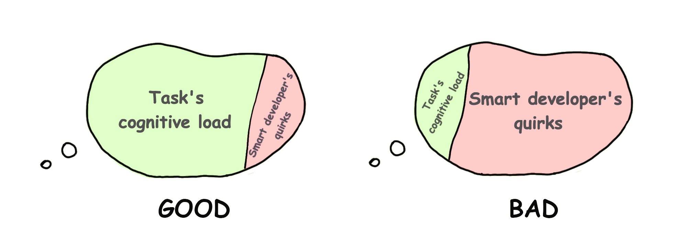
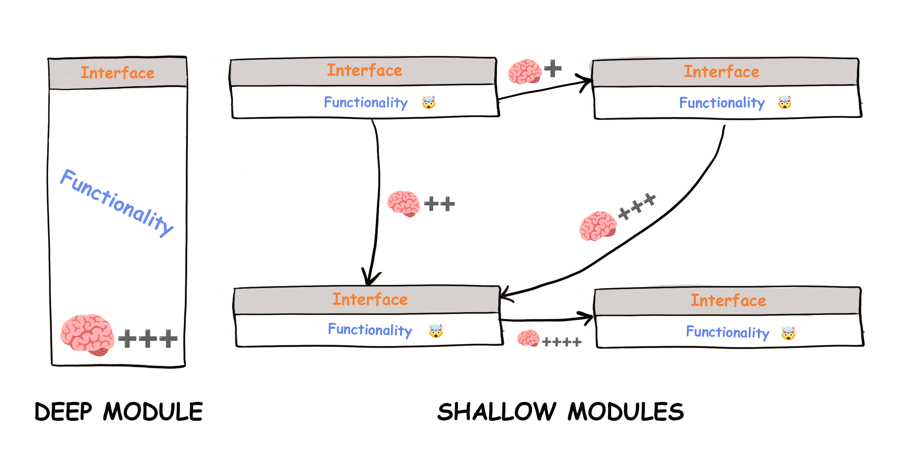

# 认知负荷的重要意义

## 简介(Introduction)

这世上有如此多的“流行语”和“最佳实践”，但是让我们来关注一些更基础的东西。那就是——开发人员在浏览代码时的“困惑程度”。

困惑是以时间和金钱为代价的。困惑是由高*认知负荷*造成的。这不是什么花哨的抽象概念，而是一种**人类的基本限制因素**。

由于我们花在阅读和理解代码上的时间远远多于编写代码的时间，所以我们应该不断地问自己，我们是否在代码中嵌入了过多的认知负荷。

## 认知负荷(Cognitive load)

> “认知负荷”（Cognitive load）指的是开发人员为了完成一项任务而需要进行思考的量。

在阅读代码时，你会将诸如变量值、控制流逻辑和调用序列等内容放入你的脑海中。

一般人在[工作记忆](https://baike.baidu.com/item/%E5%B7%A5%E4%BD%9C%E8%AE%B0%E5%BF%86/5197761)中大约可以保存[四个这样的块](https://github.com/zakirullin/cognitive-load/issues/16)。一旦认知负荷达到这个临界值，理解事物就变得更加困难。

*假设我们被要求对一个完全陌生的项目进行一些修复。并被告知在此之前，有一位非常聪明的开发人员在项目中贡献了代码。使用了许多炫酷的架构、花哨的库和前沿的技术。换句话说*，**作者给我们带来了很高的认知负荷。**


我们应该尽可能地减少我们项目中的认知负荷。

## 认知负荷的类型(Types of cognitive load)

**内在的** - 任务本身固有的难度造成的。它无法被降低，是软件开发的核心要素。

**与任务无关的** - 由信息所呈现的方式促成。通常由与任务不直接相关的因素引起，例如：聪明人的“骚操作”。这些是可以避免的。我们将关注这种类型的认知负荷。



让我们直接来看看一些“与任务无关的”认知负荷的具体实际例子。

---

我们将认知负荷的“困惑程度”定义如下：

`🧠`: 刚初始化的“工作记忆”，没有认知负荷

`🧠++`: 在我们的“工作记忆”中放入了两项内容，认知负荷增加（`+`越多，负荷越多）

`🤯`:在我们的“工作记忆”中放入了超过4项内容，“工作记忆”“溢出了”

> 我们的大脑实际要更加复杂而神秘，但是我们可以用这个简单模型来简要描述。

## 复杂的条件控制(Complex conditionals)

```go
if val > someConstant // 🧠+
    && (condition2 || condition3) // 🧠+++, 前一个条件必须是 true, c2 和 c3 中的任意一个应该为 true
    && (condition4 && !condition5) { // 🤯, 然后我们就被这个地方整懵逼了
    ...
}
```

## 嵌套的 ifs (Nested ifs)

```go
if isValid { // 🧠+, 这一步我们目前只关心 isValid 这一个变量（是否有效）
    if isSecure { // 🧠++, 这一步我们要同时关心 isValid 和 isSecure 两个变量（是否有效并且安全）
        stuff // 🧠+++
    }
} 
```

和“提早返回”做对比：

```go
if !isValid
    return

if !isSecure
    return

// 🧠, 我们不用去关心已经返回的东西，走到这一步代表所有校验已经通过

stuff // 🧠+
```

我们可以只专注于所我们关心的内容，从而将我们的“工作记忆”从各种先决条件中解放出来。

## 多继承噩梦 (Inheritance nightmare)

我们被要求为我们的管理员用户更改一些内容 `🧠`：

`AdminController extends UserController extends GuestController extends BaseController`

噢，一部分的功能代码在`BaseContorller`，让我们瞅瞅：`🧠+`

在`GuestController` 中引入了基本的角色机制：`🧠++`

在`UserController` 中修改了部分东西：`🧠+++`

终于，我们来到了`AdminController`，让我们开始编码吧！：`🧠++++`

噢，等下，这里还有一个继承了`AdminController`的`SuperuserController`。修改了`AdminController`的话，一些继承泪中的逻辑就会被破坏，所以我们要先了解一下`SuperuserController`：`🤯`

优先使用组合而非继承。我们就不展开说明了——这里有很多[参考资料](https://www.youtube.com/watch?v=hxGOiiR9ZKg)。

## 过多的小方法，类或模块(Too many small methods, classer or modules)

> 下述方法，类和模块是可以相互替换的

像 “方法应该少于 15 行代码” 或 “类应该很小” 这样的咒语被证明是有些错误的。

**深模块**【Deep module】- 简单的接口实现复杂的功能

**浅模块** 【Shallow module】- 接口相对于其所提供的小功能来说相对复杂



拥有太多的“浅模块”会使项目难以理解。**我们不仅要记住每个模块的职责，还要记住它们的所有交互**。为了理解“浅模块”的目的，我们首先需要查看所有相关模块的逻辑。`🤯`

> [信息隐藏](https://baike.baidu.com/item/%E4%BF%A1%E6%81%AF%E9%9A%90%E8%97%8F/3230616)是无比重要的，当然我们并不会在浅模块中隐藏很多复杂性。

我有两个宠物项目，他们都有差不多 5千行代码。第一个项目有 80 个“浅类”【shallow class

】，而第二个项目只有 7 个“深类”【deep class】，我已经有一年半没有维护这俩项目了。

一次我回过头来维护项目，我认识到在第一个项目中理清那 80 个类之间的所有交互是一件极其困难的事情。在我开始编码之前，我必须重新建立大量的认知负荷。另一方面，我能够很快地理解第二个项目，因为它只有几个具有简单接口的“深类”【deep class】。

> 最好的组件是那些提供了强大功能但接口简单的组件。  
> 
> ** John K. Ousterhout**

UNIX I/O 的接口非常简单。它只有五个基本调用：

```c
open(path, flags, permissions)
read(fd, buffer, count)
write(fd, buffer, count)
lseek(fd, offset, referencePosition)
close(fd)
```

这个接口的现代实现【modern implementation】有**数十万行代码**。许多复杂性隐藏在引擎盖下。然而，得益于其简单的接口，它是很容易使用的。

> 这个“深模块”【deep module】的示例取自 John K. Ousterhout 的 [软件设计的哲学【A Philosophy of Software Design】](https://web.stanford.edu/~ouster/cgi-bin/book.php)一书。这本书不仅涵盖了软件开发中复杂性的本质，而且是对 Parnas 颇具影响力的论文 [分解系统模块的标准【On the criteria to be used in decomposing systems into modules】](https://www.win.tue.nl/~wstomv/edu/2ip30/references/criteria_for_modularization.pdf)的最大诠释。两者都是必不可少的读物。其他相关读物：[可能是时候停止推荐清洁代码了【It's probably time to stop recommending Clean Code】](https://qntm.org/clean)、[被认为有害的小函数【Small Functions considered Harmful】](https://copyconstruct.medium.com/small-functions-considered-harmful-91035d316c29)。

P.S. 如果你认为我们是在支持那种肩负超多责任的，臃肿的“上帝对象”【God objects】，那你就错了。

## 浅模块和单一职责原则(Shallow modules and SRP)

todo
