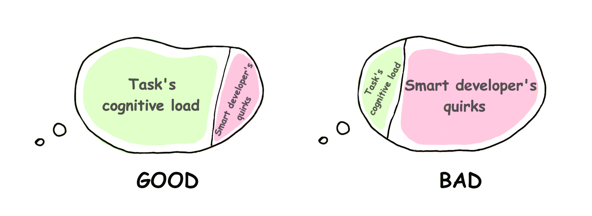
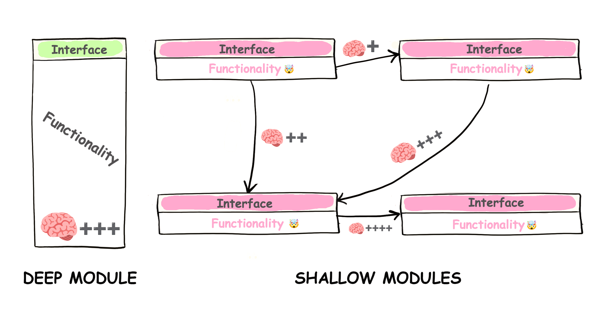
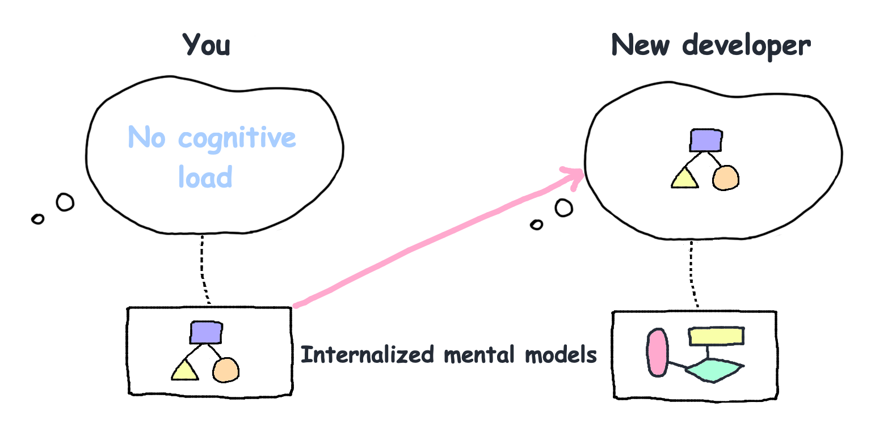

# 认知负荷的重要意义

## 简介(Introduction)

这世上有如此多的“流行语”和“最佳实践”，但是让我们把注意力转向更基础的方面。即——开发人员在浏览代码时所感受到的“困惑程度”。

困惑是以时间和金钱为代价的。困惑是由高*认知负荷*造成的。这不是什么花哨的抽象概念，而是一种**人类的基本限制因素**。

由于我们花在阅读和理解代码上的时间远远多于编写代码的时间，所以我们应该不断地问自己，我们是否在代码中嵌入了过多会给人带来认知负荷的内容。

## 认知负荷(Cognitive load)

> “认知负荷”（Cognitive load）指的是开发人员为了完成一项任务而需要进行思考的量。

在阅读代码时，人们会将诸如变量值、控制流逻辑和调用序列等内容记在脑海里。通常情况下，一般人在[工作记忆](https://baike.baidu.com/item/%E5%B7%A5%E4%BD%9C%E8%AE%B0%E5%BF%86/5197761)中大约可以保存[四个这样的部分](https://github.com/zakirullin/cognitive-load/issues/16)。一旦达到这个临界值，理解事物就变得更加困难。

*假设我们被要求对一个完全不熟悉的项目进行修复工作。并被告知在此之前，有一位非常聪明的开发人员在项目中编写了代码。采用了许多复杂高级的架构、花哨的库和先进的技术。换句话说*，**项目的前任开发者给我们带来了很高的认知负荷。**


我们应该尽可能地减少项目中会给人带来认知负荷的内容。

## 认知负荷的类型(Types of cognitive load)

**内在的** - 源于任务本身所固有的难度。它是软件开发的核心要素，且这种难度无法降低。

**与任务无关的** - 由信息的呈现方式导致。通常由与任务并无直接关联的因素引发，比如那些聪明人的 “骚操作”。并且这种类型的认知负荷是可以避免的。我们将在下文着重关注这一类型的认知负荷。



接下来让我们直接看一些“与任务无关的”认知负荷的具体实例。

---

我们将认知负荷的“困惑程度”定义如下：

`🧠`: 刚初始化的“工作记忆”，此时不存在认知负荷

`🧠++`: 在“工作记忆”中放入了两项内容，认知负荷有所增加（`+`越多，负荷越多）

`🤯`:在“工作记忆”中放入了超过4项内容，致使“工作记忆” 出现 “溢出” 状况

> 我们的大脑实际要更加复杂而神秘，这里只是运用这个简单模型对认知负荷的困惑程度进行简要描述。

## 复杂的条件控制(Complex conditionals)

```go
if val > someConstant // 🧠+
    && (condition2 || condition3) // 🧠+++, 前一个条件必须是 true, c2 和 c3 中的任意一个应该为 true
    && (condition4 && !condition5) { // 🤯, 然后我们就被这个地方整懵逼了
    ...
}
```

## 多层嵌套的 ifs (Nested ifs)

```go
if isValid { // 🧠+, 这一步我们目前只关心 isValid 这一个变量（是否有效）
    if isSecure { // 🧠++, 这一步我们要同时关心 isValid 和 isSecure 两个变量（是否有效并且安全）
        stuff // 🧠+++
    }
} 
```

和“提早返回”（先判断条件不满足时直接返回）做对比：

```go
if !isValid
    return

if !isSecure
    return

// 🧠, 我们不用去关心已经返回的东西，走到这一步代表所有校验已经通过

stuff // 🧠+
```

我们可以只专注于要执行的主要逻辑，从而使“工作记忆”从各种先决条件中解放出来。

## 多继承噩梦 (Inheritance nightmare)

我们接到要求，要针对管理员用户对某些内容进行修改 `🧠`：

`AdminController extends UserController extends GuestController extends BaseController`

噢，一部分的功能代码在`BaseController`，让我们来看看：`🧠+`

在`GuestController` 中引入了基本的角色机制：`🧠++`

在`UserController` 中修改了部分内容：`🧠+++`

终于，我们来到了`AdminController`，让我们开始编码吧！：`🧠++++`

Oh，等下，这里还有一个`AdminController`，它继承自`SuperuserController`。如果修改了`AdminController`，那么其它继承自它的类中的逻辑就会被破坏，所以我们要先了解一下`SuperuserController`：`🤯`

通过组合不同的类来实现功能，而不是过度依赖继承。关于这一点，这里就不详细阐述了——这里有很多[参考资料](https://www.youtube.com/watch?v=hxGOiiR9ZKg)。

## 存在数量过多的小方法，类或模块(Too many small methods, classes or modules)

> `下述方法、类和模块是可以相互替换的`

诸如 “方法应该少于 15 行代码” 或 “类应该很小” 之类的观点，经实践证明是存在一定错误的。

**深模块**「Deep module」- 具有简单的接口却实现复杂的功能

**浅模块** 「Shallow module」- 其接口相对于自身所提供的微小功能而言相对复杂



倘若项目中存在过多的 “浅模块”「Shallow module」，项目就会变得晦涩难懂。**因为人们不仅要记住每个模块所承担的职责，还要记住它们之间的所有交互关系**。为了弄明白“浅模块”「Shallow module」的用途，我们首先得查看所有与之相关的模块的逻辑。`🤯`

> [信息隐藏](https://baike.baidu.com/item/%E4%BF%A1%E6%81%AF%E9%9A%90%E8%97%8F/3230616)至关重要，当然我们并不会在“浅模块”「Shallow module」中隐藏大量复杂性。

我有两个业余项目，每个项目都有约 5千行代码。第一个项目包含 80 个“浅类”「shallow class

」，而第二个项目仅有 7 个“深类”「deep class」，我已经有一年半没对这两个项目进行维护了。

有一次我回过头来维护项目，我发现要理清第一个项目中那 80 个类之间的所有交互关系，简直难如登天。在我开始编码之前，我不得不重新构建大量的认知负荷。另一方面，我能迅速理解第二个项目，因为它只有几个有着简单接口的“深类”「deep class」。

> 在各种组件当中，最优秀的是既能够提供强大的功能表现，又具有简单易用的接口设计的组件 。
> 
> 「The best components are those that provide powerful functionality yet have simple interface.」
> 
> **John K. Ousterhout**

UNIX I/O 的接口非常简单。它只有五个基本调用：

```c
open(path, flags, permissions)
read(fd, buffer, count)
write(fd, buffer, count)
lseek(fd, offset, referencePosition)
close(fd)
```

这个接口的现代实现「modern implementation」有**数十万行代码**。尽管其实现复杂，但因为其具有简单的接口，所以使用起来很便捷。

> 这个“深模块”「deep module」的示例源于 John K. Ousterhout 的 [软件设计的哲学【A Philosophy of Software Design】](https://web.stanford.edu/~ouster/cgi-bin/book.php)一书。这本书不仅阐述了软件开发中复杂性的本质，而且是对 Parnas 颇具影响力的论文 [分解系统模块的标准【On the criteria to be used in decomposing systems into modules】](https://www.win.tue.nl/~wstomv/edu/2ip30/references/criteria_for_modularization.pdf)的最大诠释。这两本书都是必读之物。其他相关读物：[可能是时候停止推荐清洁代码了【It's probably time to stop recommending Clean Code】](https://qntm.org/clean)、[被认为有害的小函数【Small Functions considered Harmful】](https://copyconstruct.medium.com/small-functions-considered-harmful-91035d316c29)。

P.S. 如果你认为我们是在支持那种承担过多责任、臃肿不堪的被称为 “上帝对象” 「God objects」的事物，那你就误解我们了。

## 浅模块和单一职责原则(Shallow modules and SRP)

很多时候，我们最终会遵循“一个模块应该只负责一件事”这一模糊的原则，进而创建出大量的“浅模块”「Shallow modules」。可这个模糊的“一件事”究竟是什么？比如实例化一个对象算是“一件事”，对吗？如此看来，像[MetricsProviderFactoryFactory](https://minds.md/benji/frameworks)这种名称复杂的事物似乎并无不妥。然而，这类事物的类名和接口比其完整实现更令人费解，这到底是一种怎样的抽象呢？恐怕某些地方存在一些问题。

> 在“浅组件”「Shallow components」之间来回切换会使人疲惫不堪，而[线性思维](https://blog.separateconcerns.com/2023-09-11-linear-code.html)对人类来说是更自然的思维方式。

我们对系统进行调整和改变，其目的在于满足用户以及利益相关方的需求。并且我们有责任对他们履行应尽的义务。

> 一个模块应当只专注于为一个特定的用户或者利益相关方服务，并且只对这一个对象负责。

这便是单一职责原则的全部内涵。简单来说，如果我们在某个地方引入了一个 bug，随后有两个不同业务模块的人员都来投诉，那就意味着我们违反了这个原则。这与我们在模块中做了多少事情无关。

但就目前而言，这种解释是弊大于利的。因为即便是同一个人，对于同一条规则也可能有不同的理解方式。解释“单一职责原则”的更好方法是考量其带来了多少认知负荷。要记住“一个模块的变化会引发不同业务流的连锁反应”这一点，是需要一定心智负担的。以上。

## 过多的“浅微服务”(Too many shallow microservices)

前述的“浅 - 深模块原理”「shallow-deep module principle」与规模无关，而且，我们还能够把这个原理运用到微服务架构当中。过多的“浅微服务”「shallow microservices」并无益处——行业发展趋势正朝着“宏服务”方向发展，即服务不那么“浅”「shallow」（等同于“深”「deep」）。有一种堪称最糟糕且最难修复的现象，那就是“分布式整体”「distributed monolith」，它通常是过度细化拆分颗粒度所导致的结果。

我曾经为一家初创公司提供咨询服务，一个仅有五名开发人员的团队推出了包含 17 个(!)微服务的产品。它们的进度比计划落后了将近10个月，并且距离正式发布上线还有很长的路要走。每当有新需求出现，就会涉及4个或者更多的微服务需要修改。在进行集成联调时，诊断问题的难度也是急剧上升。上线所需时间和开发人员的认知负荷都高得令人难以接受。`🤯`

这是应对新系统不确定性的正确方式吗？一开始就期望找到正确的逻辑边界是极为困难的。关键在于要尽量推迟决策时间，因为越到后期，可供参考的信息就越多，从而能更好地做出决策。如果我们预先确定网络层的设计方案，之后再想修改这个设计就会变得极其艰难。然而，该团队使用此架构的唯一理由是：“FAANG（脸书、亚马逊、苹果、网飞和谷歌）这些公司已经证实了微服务架构是行之有效的”。*醒醒吧，别再做不切实际的美梦了*。

[Tanenbaum-Torvalds 辩论](https://en.wikipedia.org/wiki/Tanenbaum%E2%80%93Torvalds_debate)指出 Linux 的单体结构「monolithic design」设计是有缺陷并且过时的，应该用微内核架构取而代之。确实，从理论以及美学方面综合考虑，微内核设计似乎更优越。但事实上————三十年过去了，基于微内核的 GNU Hurd 仍在开发中，而采用单体结构的 Linux 无处不在。当前页面由 Linux系统支持的，你的智能茶壶也是由 Linux系统提供支持的。（单体结构的 Linux）。

经过精心设计且拥有真正隔离模块的单体系统，在很多情况下会比由众多微服务组成的架构更加灵活。同时，维护这样的单体系统所需的认知成本要低得多。只有在单独部署的需求至关重要的情况下，例如扩展开发团队，才应该去考虑在模块之间添加网络层，而这个网络层在未来可能会演变成微服务。

## 具有强大特性和功能的语言(Feature-rich languages)

在我们特别喜爱的某种编程语言推出新的功能特性时，我们往往会兴奋不已。随后，我们会花些时间去学习这些新特性，并在编编码时运用他们。

要是新特性众多，我们可能会花费半小时去尝试几行代码以使用这些特性，这着实有些浪费时间。然而更糟的是，当你日后再回过头来看这些代码时，你将不得不再次从头梳理整个思考的过程！

**你不但需要全面理解一个复杂的程序，还得弄清自己当初为何认为在这个程序中使用某个特性来解决问题是合理、可行的。**`🤯`

这些内容是Rob Pike提出的。

> 通过限制可选事物的数量来降低认知过程中的认知负荷。

使用语言特性并无不妥，前提是它们彼此*正交「orthogonal」*【互独立、不相关】【在这里表示语言特性之间相互独立，不会相互干扰或冲突。】

<details>
  <summary><b>一位拥有20年C++经验的工程师的想法 ⭐️</b></summary>
  <br>
  前几日，当我浏览我的 RSS 阅读器时，留意到 “C++” 标签下竟有约三百篇未读文章。从去年夏天至今，我未曾读过一篇有关 “C++” 的文章，而这种感觉棒极了！<br><br>
  到目前为止，我使用C++已达 20 年之久，这几乎占据了我人生三分之二的时光。我的大部分经验都耗费在处理它那些最为晦涩难懂的部分上（比如各种各样的未定义行为）。这是一种无法复用的经验，如今要将这些经验全部抛开，感觉有些奇妙。<br><br>
  举个例子，你能想象吗？<code>||</code>在<code>requires ((!P<T> || !Q<T>))</code> 和 <code>requires (!(P<T> || Q<T>))</code>中有不同的含义。第一种情况是约束析取「constraint disjunction」，第二种情况则是常见的逻辑或「logical OR」运算符，并且它们的行为并不一致。<br><br>
  在 C++20 之前，对于普通类型「trivial type」，不能简单地分配空间后直接使用<code>memcpy</code>复制一组字节 —— 这样不会启动对象的生命周期。在 C++20 中，这个问题得到了解决，但语言的认知负荷却不降反增。<br><br>
  认知负荷在不断增加，即便问题已经得到了处理。作为专业人士，我需要了解哪些问题被修复了、何时修复以及修复之前的情况。当然，C++ 擅长对遗留代码提供支持，但这也意味着<b>我们会面临</b>那些遗留代码拥有的遗留问题。例如，上个月我的一位同事向我询问了 C++03 中的一些代码行为。<code>🤯</code><br><br>
  曾经有 20 种初始化方式。然后统一初始化语法被添加了进来。现在我们有 21 种初始化方式。顺便问一下，有人还记得从初始化列表中选择构造函数的规则吗？是关于以信息损失最小的方式进行隐式转换，<i>但是如果</i>值是静态已知的，那么……<code>🤯</code><br><br>
  <b>这种增加的认知负荷并非源于手头的业务任务，也不是领域内在的复杂性所致。仅仅是由于历史原因而存在</b>（<i>外在认知负荷</i>）<br><br>
  我不得不制定一些规则。比如，如果某行代码不是很明显易理解，并且我需要记住特定标准时，那么最好不要那样编写代码。顺带一提，标准大概有 1500 页长。<br><br>
  <b>我绝不是在指责 C++。</b>我热爱这种语言。只是我现在有些累了。
</details>

## 业务逻辑和HTTP状态码(Business logic and HTTP status codes)

在后端，我们返回以下内容：

`401` 表示jwt令牌已经过期

`403` 表示访问权限不足

`418` 则是一种趣味设定，表示服务器拒绝冲泡咖啡，因为它其实是个茶壶。「I'm a teapot」

前端开发人员利用后端的 API 来实现登录功能时，不得不暂时在大脑中承担以下认知负荷：

`401` 表示jwt令牌过期// `🧠+`，好吧只是暂时在脑子里记一下。

`403` 表示访问权限不够// `🧠++`

`418` 「I'm a teapot」// `🧠+++`

前端开发人员将（希望）在他们这边引入某种 “数字状态 -> 含义” 字典，这样后续的开发人员就无需在脑海中重现构建这种映射关系了。

接着，QA人员参与到项目中：“嘿，我收到了`403`状态码，这是令牌过期了还是权限不足呢？”

**QA 人员无法直接开展测试工作，因为他们首先得重新梳理后端人员创建的认知负荷。**

为什么要在我们的工作记忆中保留这种自定义映射呢？更好的做法是从 HTTP 传输协议中抽象出业务详细信息，并直接在响应正文中返回具有自描述性质的代码，比如：

```json
{
    "code": "jwt_has_expired"
}
```

如此一来，前端开发人员的认知负荷：`🧠`（刚初始化的“工作记忆”，此时没有认知负荷）

QA 人员的认知负荷：`🧠`

同样的规则适用于各种涉及数字的情况，（无论在数据库中还是其他任何地方）。**自描述字符串是一种更好的选择**。毕竟，现在早已不是需要为仅有 640K 内存的计算机优化内存使用的时代了。

> 人们常常花费时间在 “401” 和 “403” 的含义区别上争论不休，并且依据各自的理解来做出决定。每当有新的开发人员加入，他们需要建立新的思维过程。或许你已经记录了代码的 “设计决策原因”（ADRs）清单，以便新人理解当初你们做的决定。但到头来，这些可能都没什用。我们虽然能够明确地把错误划分成“用户相关”和“服务器相关”的类型。但在这两种类型之外，错误的归属和原因就变得模糊不清了。

P.S. 区分 “认证”「authentication」 和 “授权” 「authorization」通常是一种精神负担。我们可以使用更简单的术语，如 [“登录”「login」 和 “权限”「permissions」](https://ntietz.com/blog/lets-say-instead-of-auth/)来降低认知负荷。

## 滥用DRY「Do not repeat yourself」原则(Abusing DRY principle)

不要重复编写相同的代码 —— 这是你在软件工程师的学习和工作过程中，被反复灌输的重要原则之一。它植根于我们的观念当中，以至于我们对代码冗余几乎零容忍，哪怕只有几行的重复代码也不行。总体而言，它是一个很好的基本原则，但过度遵循它可能会带来过多的认知负荷，令我们不堪重负。

当前，人们构建软件时通常基于逻辑分离的组件。这些一般分布在多个代码库中，代表着不同的服务。在你努力消除重复的过程中，可能会使原本不相关的组件变得紧密耦合。这样一来，后续对某个部分的修改可能会在其他看似毫无关联的地方引发意想不到的后果。同时，这也会削弱在不影响整个系统的前提下替换或修改单个组件的能力。`🤯`

事实上，即使在单模块软件中也会出现类似的问题。你可能会依据自己主观感觉上的相似性（但长远来看可能并不存在）来过早地提取通用功能。而这样做可能会产生不必要的抽象，进而使得软件变得难以修改或扩展。

Rob Pike 曾经说过：

> 适当的复制要优于不必要的依赖。「A little copying is better than a little dependency」

我们并不想重新发明那些已经很完善的东西，比如功能强大的 “轮子” 。正因如此，我们愿意引入大型且复杂的库，即使只是为了使用其中一些我们自己本可以轻松编写出来的小函数。

**你所依赖的所有项目都如同你的代码。** 当出现问题时，浏览跟踪 10 层以上的堆栈来找出问题所在，是一件痛苦的事。

## 与框架紧密耦合(Tight coupling with a framework)

框架中存在着许多 “魔力”。如果我们过于依赖框架，**就会迫使所有后续参与开发的人员首先去学习这种 “魔力”**。而这一过程可能耗时数月之久。虽然框架可以帮助我们在短短几天内启动 MVP【最小可行产品】，但长远来看，它们往往会徒增不必要的复杂性和认知负荷。

更糟的是，在某些情况下，当出现一个与现有架构不匹配的新需求时，框架很可能会对该需求的实现构成极大阻碍。自此，人们会在当前框架基础上开辟新的分支，并维护一个定制版本。设想一下，一个新加入的成员，为了能够开展工作，需要承受多大的认知负荷（即学习这个定制版本的框架）。`🤯`

**但这绝不意味着我们提倡所有东西都从零开始开发！**

我们可以采用不受特定框架束缚的方式来编写代码。例如，业务逻辑不应该被放置在框架内部；相反，它应该通过调用框架所提供的组件来实现。我们可以在核心业务逻辑之外搭建一个框架，用来处理一些通用功能。这样一来，其他开发人员就能够像使用类库一样调用这个框架。这样做能够让新的开发者从一开始就能投入工作，而不必先去了解和框架相关的复杂内容。

> [为什么我讨厌“框架”「Why I Hate Frameworks」](https://minds.md/benji/frameworks)

## 六边形/洋葱架构(Hexagonal/Onion architecture)

在工程学领域，所有这些东西都能带来某种令人兴奋之感。

多年来，我一直热衷于提倡洋葱架构。在诸多项目中，我都运用了这一架构，并且还积极鼓动其他团队也采用。然而，结果却是项目复杂性大幅增加，光是文件数量就翻了一番。很多时候，我们感觉自己在编写大量的“胶水代码”。随着需求的持续变更，我们不得不对多层抽象结构进行修改，整个开发过程变得枯燥、乏味。`🤯`

从一个调用跳转到另一个调用，不断地阅读和分析以确定问题所在——这是快速解决问题必备的重要要求。在使用这种洋葱架构多层解耦的情景下，在寻找故障具体位置过程中，可能需要追踪众多看似毫无关联的线索，而且这些线索呈指数级增长的。每一次这样的跟踪都会占用我们有限的工作记忆空间。`🤯`

这种架构乍一看在直觉上是合理的，但每次当我们在项目中尝试应用时，总会发现其弊大于利。最终，我们彻底放弃了洋葱架构，转而支持被广泛认可的传统依赖倒置原则。如此一来我们**无需学习端口 / 适配器概念，也不用引入不必要的水平抽象层，从而避免了承受与之相关的不必要的认知负荷。**

> 需知，不要为了架构而盲目添加抽象层。只有当你出于实际需求且需要合理扩展时才考虑添加。**[抽象层并非毫无代价的【Layers of abstraction aren't free of charge】](https://blog.jooq.org/why-you-should-not-implement-layered-architecture)，它们会占据我们的工作记忆空间**

倘若你认为这种分层方式能够让你迅速地更换数据库或者其他的依赖对象，那就大错特错了。更改存储往往会引发诸多问题，相信我们，对数据访问层进行抽象往往是最不该考虑的事情。即便是在最好的情况下，抽象或许能节省 10% 的迁移时间（如果有的话），但真正棘手的是数据模型无法兼容、通信协议问题、分布式系统挑战和[隐式接口](https://www.hyrumslaw.com/)问题。**所以，如果这种架构在未来不能带来回报，我们又为什么要为其承担高认知负荷的代价呢？** 而且，在大多数情况下，未来可能根本不会出现更换某些核心组件的需求。

虽然这些分层架构促使应用程序从“以传统数据库为中心”向“不依赖基础设施”「 infrastructure-independent」转变，使应用的核心业务逻辑独立于外部事物。但这种理念并非创新之举。

这些架构并非最基础的架构，它们是在更基础的架构基础上，因主观和偏见而产生的。我们为何要遵循这些主观偏见呢？更好的做法是遵循依赖倒置原则、重视认知负荷和信息隐藏这些基础架构理念。【[讨论](https://github.com/zakirullin/cognitive-load/discussions/24)】

## 领域驱动设计(DDD)

尽管领域驱动设计「DDD」常常遭受误解，但其在某些方面的确有卓越之处。

人们通常说的 “我们用 ‘DDD’ 写代码”，这种说法其实是有些奇怪的，因为 DDD 是和“问题空间「problem space」”相关的，而不是和“解决方案空间「solution space」”相关的。

> 译注：
> 
> - problem space: 问题空间，简单理解就是当前环境下业务所面临的一系列问题和背后的需求。
> 
> - solution space: 解决方案空间，则是针对问题空间的解决方案，它思考的是如何设计实现软件系统以解决这些问题，它属于工程设计实施阶段，通常是技术专家主导的解决方案设计和实现。

无处不在的语言、领域、有界上下文「bounded context」、聚合、事件风暴「event storming」等概念都属于问题空间的范畴。它们旨在协助我们洞察领域并确定其边界。DDD 能够让开发人员、领域专家和业务人员使用一种统一的语言来实现高效沟通。然而，我们往往侧重于特定的文件夹结构、服务、存储库之类的解决方案空间技术，却忽略了 DDD 在问题空间方面的价值。

我们对DDD的阐释很有可能具有独特性和主观性。如果我们依照这种理解来构建代码（即如果我们制造了很多无关的认知负荷），那么未来的开发人员注定要失败。`🤯`

## 示例(Examples)

- 我们的架构是标准的 CRUD 应用架构，是[基于Postgres 的 Python 单体应用](https://danluu.com/simple-architectures/)
- Instagram 如何在仅有 [3 名工程师](https://read.engineerscodex.com/p/how-instagram-scaled-to-14-million) 的情况下，将用户规模扩展到的 1400 万的呢？
- 我们喜爱的公司 “哇，这些人 [聪明绝顶](https://kenkantzer.com/learnings-from-5-years-of-tech-startup-code-audits/)” ，却在很大程度上遭遇了失败。  
- 有一个功能连接着整个系统。如果你想知道系统是如何运作的 - [请阅读](https://www.infoq.com/presentations/8-lines-code-refactoring)

这些架构相当枯燥，也很容易理解，任何人都能轻松掌握，无需耗费太多脑力。

安排初级开发人员参与架构审查。他们会助力你识别出那些对心智要求颇高的代码。

## 熟悉的项目中的认知负荷(Cogitive load in familiar projects)

> 问题在于，熟悉并不等同于简单。二者给人的*感觉*看似是一样的 —— 都能让人不用费太多脑力就能轻松地在代码之间穿梭 —— 但原因却截然不同。你所使用的每一个 看似“聪明”（实则是“自我放纵”）和非惯用的技巧，都会让其他人在学习时备受折磨。一旦他们完成学习，他们使用代码的难度便会降低。因此，要认识到如何去简化自己已经熟悉的代码并非易事。这就是我为何要让 “新来的孩子” ，趁着在代码对他而言还没变得过于僵化之前，对代码进行审视！
> 
> 很可能之前的作者，是逐步造就了这一巨大混乱的代码。而你是第一个试图一次性理解它的人。
> 
> 在我的课堂上，我曾描述过我们有一天见到的一个庞大的 SQL 存储过程，其巨大的 WHERE 子句中包含了数百行条件语句。有人问，怎么会有人能把它弄得如此糟糕。我告诉他们：“当只有两三个条件语句时，再添加一个似乎没有影响。当有二三十个条件语句时，再另添加一个看起来也没差！”
> 
> 除了你有意为之的选择之外，代码库并不会受到任何 “简化之力”的作用。简化需要付出努力，然而人们却经常无暇顾及。
> 
> *感谢 [Dan North](https://dannorth.net)的评论*。

如果你已经将这个项目的心理模型内化到长期记忆中，你就不会承受高认知负荷。



需要学习的心智模型越多，新开发人员开始投入工作所需的时间就越长。

一旦有新人加入你的项目，就尝试去衡量他们的困惑程度（结对编程或许会有所帮助）。倘若他们持续困惑的时间超过 40 分钟，——意味着你的代码存在需要改进之处。

若你的项目能保持较低的认知负荷，那么新员工在入职后的最初几个小时内，就能为公司的代码库贡献力量。

## 结论(Conclusion)

想象一下，我们在第二章中推断的并非真实情况。倘若如此，那么我们刚刚否定的结论，以及上一章中我们认为有效的结论，或许也不是正确的。`🤯`

你感觉到了吗？你不仅需要在文章中来回跳转才能理解其含义（浅模块「shallow modules」！），而且段落总体上也很难理解。我们刚刚在你的脑海中制造了不必要的认知负荷。**请不要对你的同事这样做。**


我们应当减少一切超出工作本身所带来的认知负担。

---

[LinkedIn](https://www.linkedin.com/in/zakirullin/), [X](https://twitter.com/zakirullin) , [GitHub](https://github.com/zakirullin)

[Readable version](https://zakirullin.md/cognitive)

<details>
  <summary><b>认知负担与干扰因素(Cognitive load and interruptions)</b></summary>
  <br>
</details>
<details>
  <summary><b>编码原理和经验(Coding principles and experience)</b></summary>
  <br>
  <a href="https://twitter.com/flaviocopes">@flaviocopes</a>
</details>
